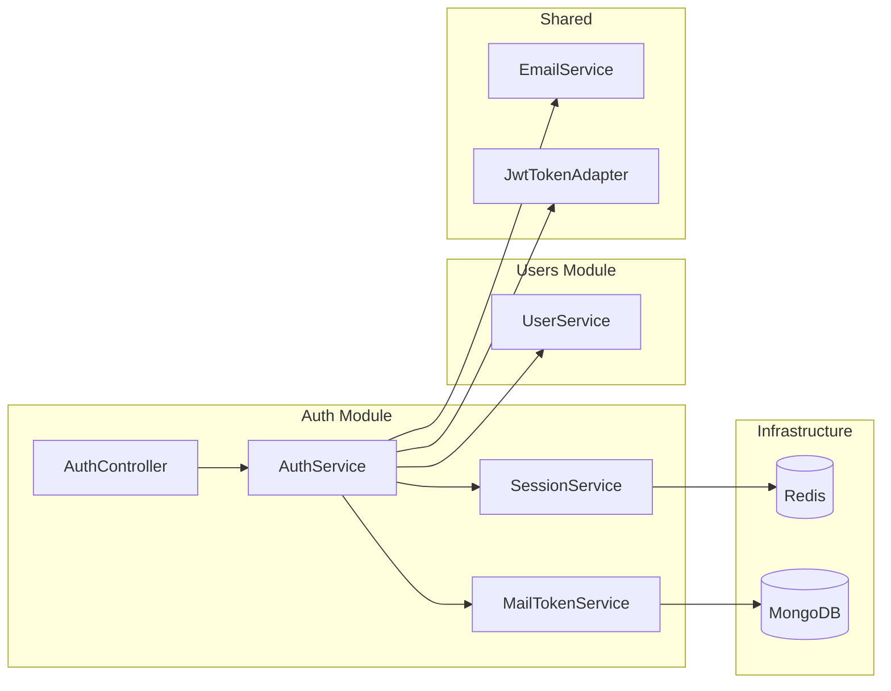
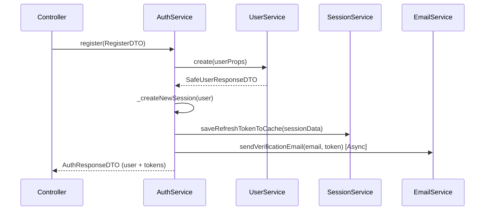
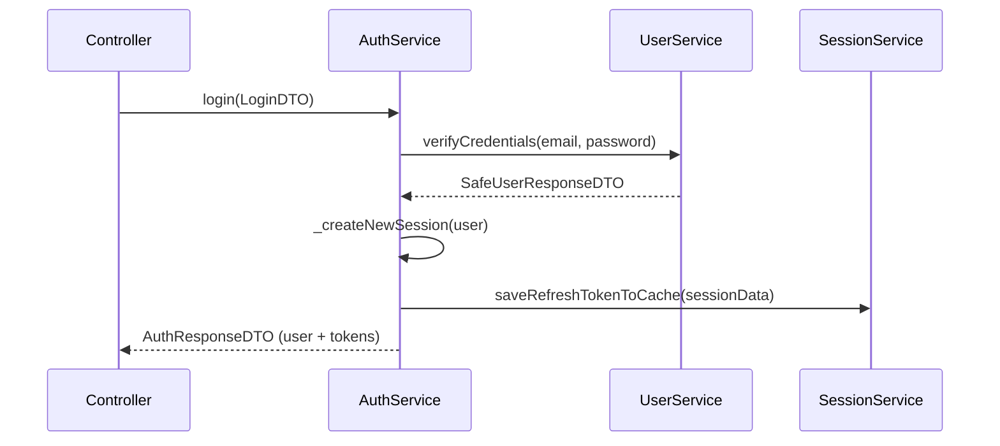
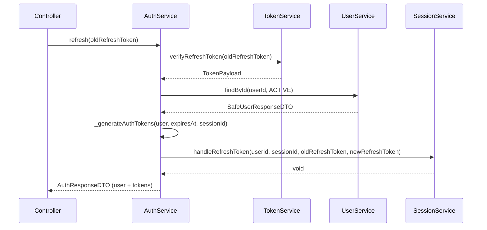
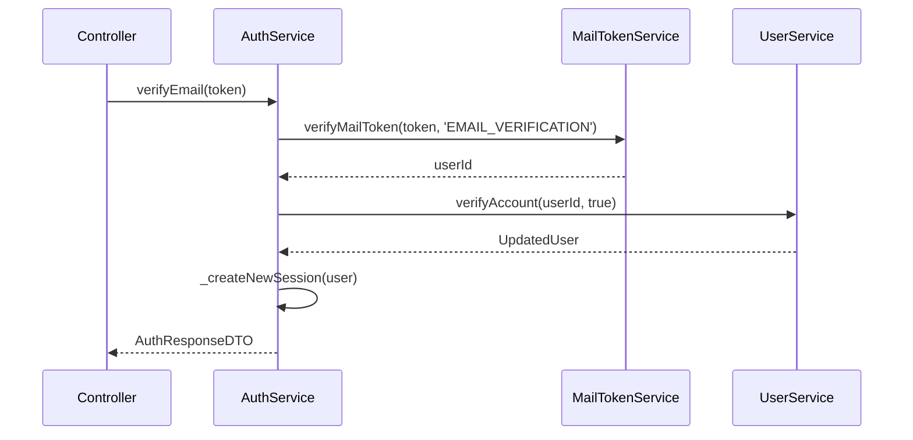

# Auth Module

## 1. Responsibility

The **Auth** module handles authentication, session management, and identity verification. It acts as the security gateway for the system. Its boundaries and goals are:

| Goal | Description |
|------|-------------|
| **Authentication** | Support User Registration and Login (Email/Password) |
| **Session Management** | Manage JWT-based sessions with Token Rotation and Revocation |
| **Identity Verification** | Handle Email Verification via unique opaque tokens |
| **Account Recovery** | Manage Forgot/Reset Password flows securely |
| **Security Enforcement** | Prevent Refresh Token reuse and handle session hijacking detection |

---

## 2. Dependencies

### Internal Module Dependencies

| Module | Usage |
|--------|-------|
| **Users** | User creation, credential verification, profile fetching, and status updates (password/verification) |
| **Shared** | Error enums (`ErrorAuthCodes`, `ErrorUserCodes`), Base response types, Email service interface, and utility functions |

### External / Infrastructure Dependencies

| Dependency | Purpose |
|------------|---------|
| **JWT** | Access and Refresh token generation/verification via `ITokenService` |
| **Redis / Cache** | Session storage for refresh token rotation and revocation via `SessionService` |
| **MongoDB** | Persistence for mail tokens (verification/reset) via `MailTokenModel` |
| **Email Service** | Sending verification and reset emails via `IEmailService` |

---

## 3. Detailed Logic Flows

### 3.1 Register

1. **AuthService** calls **UserService** to create a new user.
2. If successful, it initializes a new session via `_createNewSession`.
3. It generates a pair of tokens (Access/Refresh) and saves the session to the cache.
4. It triggers an email verification task in the background.
5. Returns the user profile and the token pair to the client.

---

### 3.2 Login

1. **AuthService** delegates credential verification to **UserService**.
2. If credentials match, it creates a new session and returns tokens.

---

### 3.3 Token Refresh (Rotation)

- Implements **Token Rotation**: Every time a refresh token is used, a new pair is issued.
- The old refresh token is moved to a "Used" list in the session to detect potential reuse/hijacking.

---

### 3.4 Email Verification

- Validates the opaque token from the database.
- Updates the user status to `isVerified: true`.
- Automatically logs the user in by creating a session.

---

### 3.5 Password Reset Flow

**Forgot Password:**
1. Verifies user existence via `Users` module.
2. Generates an opaque `MailToken` and sends it via email.

**Reset Password:**
1. Validates the `MailToken`.
2. Calls **UserService** `changePassword` to update the hash.
3. Invalidates the token after use.

---

## 4. Technical Design

### 4.1 Data Schema

#### Mail Token (MongoDB)
Used for Email Verification and Password Reset.

| Field | Type | Description |
|-------|------|-------------|
| `userId` | ObjectId | Reference to the User |
| `token` | String | Unique opaque token |
| `type` | Enum | `EMAIL_VERIFICATION` or `RESET_PASSWORD` |
| `isUsed` | Boolean | Flag to prevent token reuse |
| `expiresAt` | Date | Expiration time (TTL index enabled) |

#### Session (Redis / Cache Model)
Used for tracking active sessions and refresh token rotation.

| Field | Type | Description |
|-------|------|-------------|
| `sessionId` | String | Unique session identifier |
| `userId` | String | User ID |
| `refreshToken` | String | Current valid refresh token |
| `refreshTokensUsed` | String[] | List of previously used refresh tokens (Rotation check) |
| `expiresAt` | Number | Absolute expiration timestamp |

### 4.2 Validation Rules

Based on `auth.validator.ts`.

| Field | DTO | Rule | Error Code |
|-------|-----|------|------------|
| `name` | Register | `min(2)` | `NAME_MUST_BE_AT_LEAST_2_CHARS` |
| `email` | Register/Login | `email()` | `INVALID_EMAIL_FORMAT` |
| `password` | Register | `min(6)` | `PASSWORD_MUST_BE_AT_LEAST_6_CHARS` |
| `refreshToken` | Refresh | `min(1)` | `INVALID_REFRESH_TOKEN` |
| `token` | Verify/Reset | `min(1)` | `INVALID_URL` |

### 4.3 DTO Rules

| DTO | Purpose |
|-----|---------|
| `RegisterInputDTO` | Payload for user registration |
| `LoginInputDTO` | Payload for logging in |
| `AuthResponseDTO` | Standard output containing `user` (SafeResponse) and `tokens` object |

---

## 5. Business Exceptions

| Error Code | HTTP Status | Description |
|------------|-------------|-------------|
| `INVALID_REFRESH_TOKEN` | 401 | Refresh token is invalid or malformed |
| `INVALID_SESSION` | 401 | Session has expired or been manually revoked |
| `TOKEN_REUSED_DETECTION` | 401 | A previously used refresh token was presented (Potential hijack) |
| `ACCOUNT_ALREADY_VERIFIED` | 400 | Email verification link has already been used |
| `LINK_ALREADY_USED` | 400 | Reset password link has already been used |
| `INVALID_URL` | 400 | The opaque token (URL) is invalid |
| `URL_EXPIRED` | 400 | The token (URL) has expired |
| `VERIFY_ACCOUNT_FAILED` | 500 | Database update failed during verification |
| `RESET_PASSWORD_FAILED` | 500 | Database update failed during password reset |

---

## 6. Test Cases

### Happy Path
| # | Case | Expected |
|---|------|----------|
| 1 | Register new user | 201, return User + Tokens, Verification Email sent |
| 2 | Login valid user | 200, return User + Tokens |
| 3 | Refresh token | 200, issue NEW Access/Refresh token pair |
| 4 | Logout | 200, Session revoked in cache |
| 5 | Verify Email | 200, User status updated, return User + Tokens |
| 6 | Forgot Password | 200, Reset Email sent |
| 7 | Reset Password | 200, Password updated, Token invalidated |

### Edge Cases
| # | Case | Expected |
|---|------|----------|
| 1 | Refresh with used token | 401, `TOKEN_REUSED_DETECTION`, entire session revoked |
| 2 | Verify with expired token | 400, `URL_EXPIRED` |
| 3 | Login with wrong password | 401, `INVALID_CREDENTIALS` (from Users) |
| 4 | Register with existing email | 409, `EMAIL_ALREADY_EXISTS` (from Users) |
| 5 | Reset with non-matching token | 400, `INVALID_URL` |
