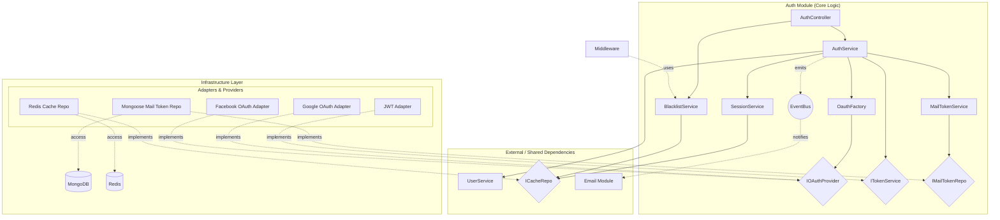
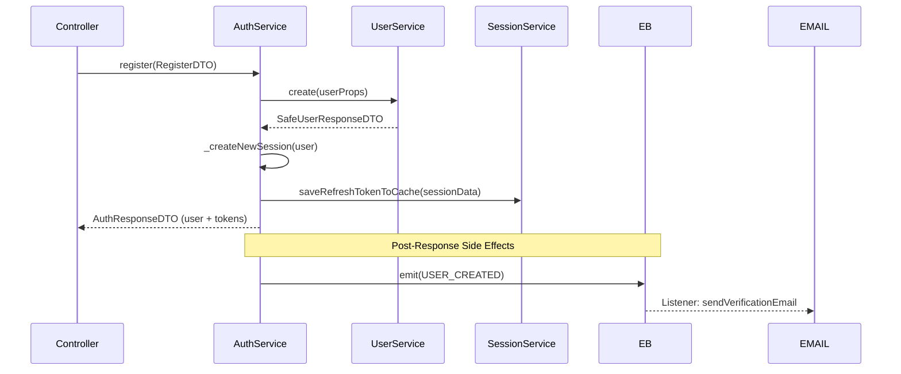
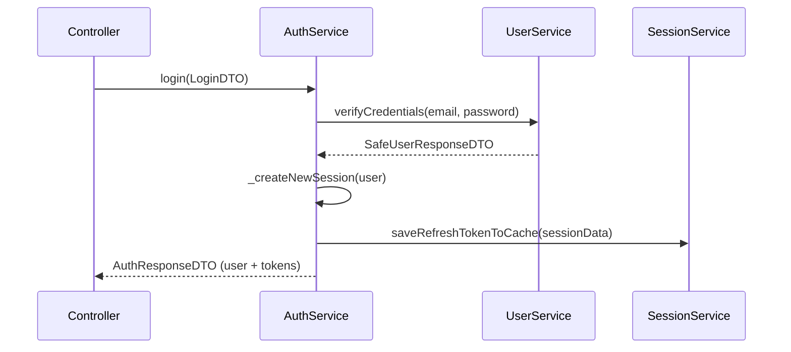
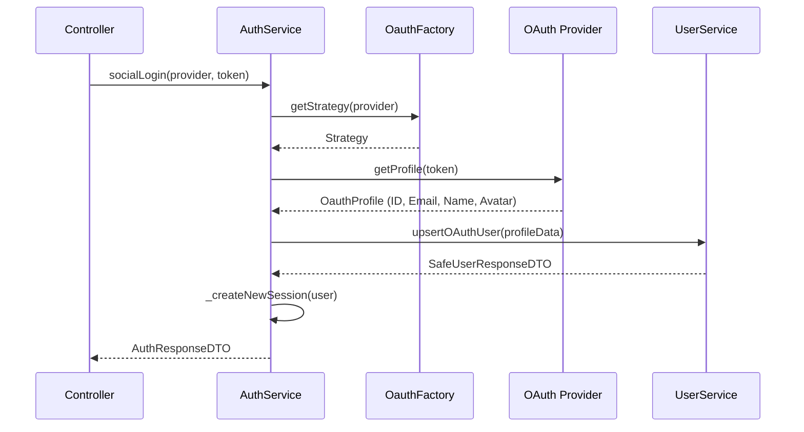
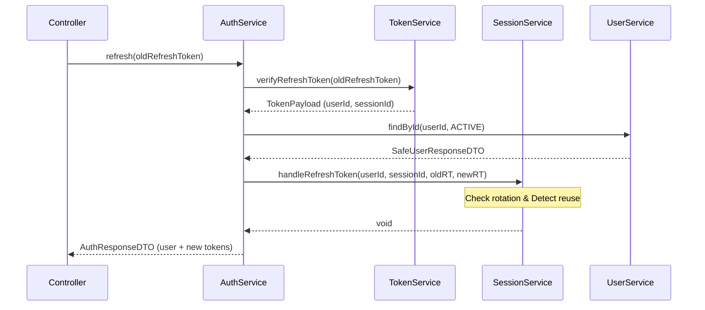
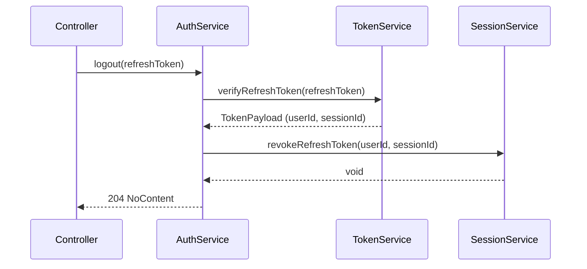
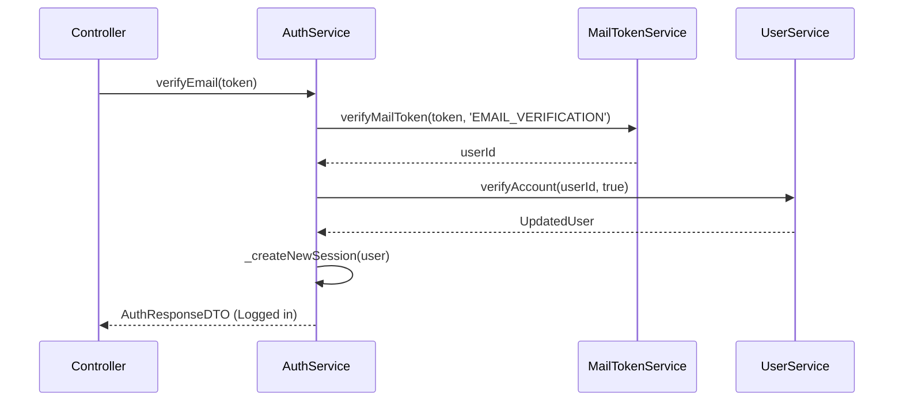
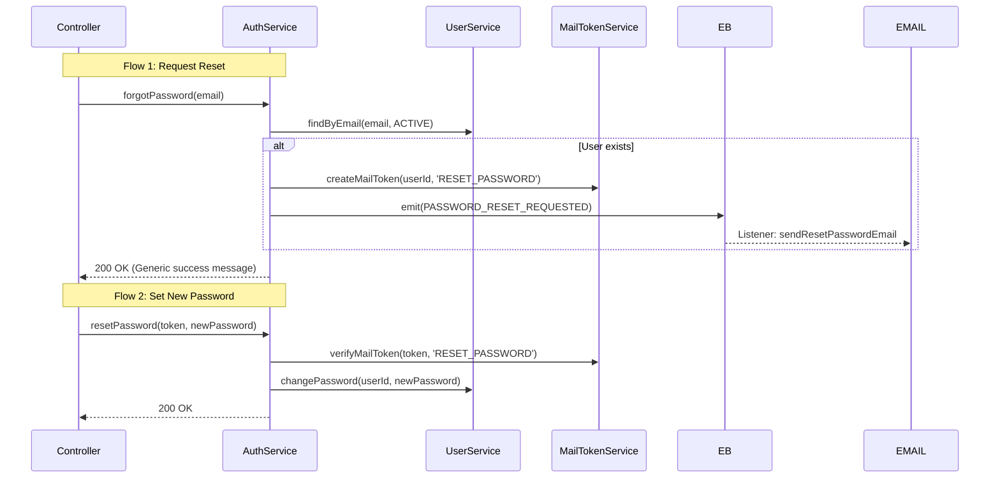

# Auth Module

## 1. Responsibility

The **Auth** module handles authentication, session management, and identity verification. It acts as the security gateway for the system. Its boundaries and goals are:

| Goal | Description |
|------|-------------|
| **Authentication** | Support User Registration and Login (Email/Password) |
| **Social Login (OAuth)** | Integration with external providers (Google, Facebook) for seamless authentication |
| **Session Management** | Manage JWT-based sessions with Token Rotation and Revocation |
| **Identity Verification** | Handle Email Verification via unique opaque tokens |
| **Account Recovery** | Manage Forgot/Reset Password flows securely |
| **Security Enforcement** | Prevent Refresh Token reuse and handle session hijacking detection |
| **IP Protection** | Implement honeypot-triggered IP blacklisting and escalation/throttling |

---

## 2. Dependencies

### Internal Module Dependencies
Internal modules that the **Auth Module** coordinates to complete business logic workflows.

| Module | Usage |
|:---|:---|
| **Users** | Managed via `UserService` for user creation, credential verification, and syncing OAuth profiles. |
| **Shared** | Provides `EventBus` for side-effect notifications, `ICacheRepo` interface for session handling, and OAuth provider definitions. |

### Infrastructure & Implementation Dependencies
Strict separation between programming interfaces (**Interfaces**) and concrete implementations (**Adapters/Repos**) following Clean Architecture principles.

| Dependency | Interface | Implementation (Infra) | Purpose |
|:---|:---:|:---:|:---|
| **Token Service** | `ITokenService` | `JWT Adapter` | Issuance and validation of Access/Refresh Tokens (JWT). |
| **Cache Store** | `ICacheRepo` | `Ioredis Cache` | Generic cache repository used by `SessionService` to manage session lifecycle in **Redis**. |
| **Mail Token** | `IMailTokenRepo` | `Mongoose Mail Token Repo` | Persistence for verification codes and password reset tokens in **MongoDB**. |
| **Email Provider** | `IEmailService` | `Managed by **Email Module** (Listener-based).` | Concrete implementation for physical email delivery via Resend API. |
| **Event Bus** | `EventBus` | `Node EventEmitter` | Centralized bus for emitting domain/security events. |
| **OAuth Factory** | `OauthFactory` | `OAuth Strategy Pattern` | Dynamic selection and management of social login strategies. |
| **Google Auth** | `IOauthProvider` | `Google OAuth Adapter` | Verification of Google OAuth tokens and profile retrieval. |
| **Facebook Auth** | `IOauthProvider` | `Facebook OAuth Adapter` | Verification of Facebook OAuth tokens and profile retrieval. |

---

### System Architecture (Auth Module)


```mermaid
flowchart TD
    subgraph Core["Auth Module (Core Logic)"]
        direction TB
        AC[AuthController]
        AS[AuthService]
        SS[SessionService]
        BS[BlacklistService]
        MTS[MailTokenService]
        OF[OauthFactory]
        EB((EventBus))
        IOP{IOAuthProvider}
        ITK{ITokenService}
        IMR{IMailTokenRepo}
    end

    subgraph External["External / Shared Dependencies"]
        direction LR
        US[UserService]
        ICR{ICacheRepo}
        EM[Email Module]
    end

    subgraph Infra["Infrastructure Layer"]
        direction TB
        subgraph Adapters["Adapters & Providers"]
            JTA[JWT Adapter]
            GOA[Google OAuth Adapter]
            FOA[Facebook OAuth Adapter]
            MTR[Mongoose Mail Token Repo]
            RCR[Redis Cache Repo]
        end
        DB[(MongoDB)]
        RD[(Redis)]
    end

    %% Main business flow
    AC --> AS
    AC --> BS
    AS --> SS
    AS --> MTS
    AS --> ITK
    AS --> US
    AS --> OF
    AS -. "emits" .-> EB((EventBus))
    
    %% Service usage
    SS --> ICR
    BS --> ICR
    MTS --> IMR
    OF --> IOP
    EB -. "notifies" .-> EM[Email Module]

    %% Middleware Interception
    Middleware -. "uses" .-> BS

    %% Dependency Inversion (Realization)
    JTA -. "implements" .-> ITK
    MTR -. "implements" .-> IMR
    RCR -. "implements" .-> ICR
    GOA -. "implements" .-> IOP
    FOA -. "implements" .-> IOP

    %% External Data Access
    MTR -. "access" .-> DB
    RCR -. "access" .-> RD
```

---

## 3. Detailed Logic Flows

### 3.1 Register


```mermaid
sequenceDiagram
    participant C as Controller
    participant AS as AuthService
    participant US as UserService
    participant SS as SessionService
    
    C->>AS: register(RegisterDTO)
    AS->>US: create(userProps)
    US-->>AS: SafeUserResponseDTO
    AS->>AS: _createNewSession(user)
    AS->>SS: saveRefreshTokenToCache(sessionData)
    AS-->>C: AuthResponseDTO (user + tokens)
    
    Note over AS, EB: Post-Response Side Effects
    AS->>EB: emit(USER_CREATED)
    EB-->>EMAIL: Listener: sendVerificationEmail
```

1. **User Creation:** **AuthService** calls **UserService** to persist the new user.
2. **Session Initialization:** If successful, it generates a unique `sessionId` and a pair of JWTs (Access/Refresh).
3. **Persistence:** The session (refresh token context) is saved to **Redis** for rotation checks.
4. **Onboarding:** Triggers an async email verification task.
5. **Response:** Returns the user profile and initial tokens immediately.

---

### 3.2 Login (Local)


```mermaid
sequenceDiagram
    participant C as Controller
    participant AS as AuthService
    participant US as UserService
    participant SS as SessionService

    C->>AS: login(LoginDTO)
    AS->>US: verifyCredentials(email, password)
    US-->>AS: SafeUserResponseDTO
    AS->>AS: _createNewSession(user)
    AS->>SS: saveRefreshTokenToCache(sessionData)
    AS-->>C: AuthResponseDTO (user + tokens)
```

1. **Verification:** **AuthService** delegates password matching to **UserService**.
2. **Session:** Creates a fresh session record in **Redis**.
3. **Response:** Returns the user profile and a new token pair.

---

### 3.3 Social Login (OAuth 2.0)


```mermaid
sequenceDiagram
    participant C as Controller
    participant AS as AuthService
    participant OF as OauthFactory
    participant OS as OAuth Provider
    participant US as UserService

    C->>AS: socialLogin(provider, token)
    AS->>OF: getStrategy(provider)
    OF-->>AS: Strategy
    AS->>OS: getProfile(token)
    OS-->>AS: OauthProfile (ID, Email, Name, Avatar)
    AS->>US: upsertOAuthUser(profileData)
    US-->>AS: SafeUserResponseDTO
    AS->>AS: _createNewSession(user)
    AS-->>C: AuthResponseDTO
```

1. **Strategy Selection:** **OauthFactory** returns the specific provider logic (Google/Facebook).
2. **External Verification:** The provider verifies the client's token and returns the user's social identity.
3. **Identity Sync:** **UserService** matches the social ID or email to an existing account, or creates a new one.
4. **Session:** Creates a standard system session, bypassing local password checks.

### 3.4 Token Refresh & Rotation


```mermaid
sequenceDiagram
    participant C as Controller
    participant AS as AuthService
    participant ITK as TokenService
    participant SS as SessionService
    participant US as UserService

    C->>AS: refresh(oldRefreshToken)
    AS->>ITK: verifyRefreshToken(oldRefreshToken)
    ITK-->>AS: TokenPayload (userId, sessionId)
    AS->>US: findById(userId, ACTIVE)
    US-->>AS: SafeUserResponseDTO
    AS->>SS: handleRefreshToken(userId, sessionId, oldRT, newRT)
    Note over SS: Check rotation & Detect reuse
    SS-->>AS: void
    AS-->>C: AuthResponseDTO (user + new tokens)
```

- **Rotation:** Every refresh issues a **new** refresh token and invalidates the old one.
- **Security:** If an old (already used) Refresh Token is presented, the **entire session** is revoked in Redis, protecting against token theft.

---

### 3.5 Logout


```mermaid
sequenceDiagram
    participant C as Controller
    participant AS as AuthService
    participant ITK as TokenService
    participant SS as SessionService

    C->>AS: logout(refreshToken)
    AS->>ITK: verifyRefreshToken(refreshToken)
    ITK-->>AS: TokenPayload (userId, sessionId)
    AS->>SS: revokeRefreshToken(userId, sessionId)
    SS-->>AS: void
    AS-->>C: 204 NoContent
```

1. **Identification:** Extracts the session context from the provided refresh token.
2. **Revocation:** Removes the session entry from **Redis**, rendering all refresh tokens for that session useless.

---

### 3.6 Email Verification


```mermaid
sequenceDiagram
    participant C as Controller
    participant AS as AuthService
    participant MTS as MailTokenService
    participant US as UserService

    C->>AS: verifyEmail(token)
    AS->>MTS: verifyMailToken(token, 'EMAIL_VERIFICATION')
    MTS-->>AS: userId
    AS->>US: verifyAccount(userId, true)
    US-->>AS: UpdatedUser
    AS->>AS: _createNewSession(user)
    AS-->>C: AuthResponseDTO (Logged in)
```

1. **Token Validation:** Verifies the opaque token exists in MongoDB and hasn't expired.
2. **Status Update:** Marks the user as `isVerified: true`.
3. **Auto Login:** Automatically creates a session so the user doesn't have to log in manually after verifying.

---

### 3.7 Password Recovery (Forgot & Reset)


```mermaid
sequenceDiagram
    participant C as Controller
    participant AS as AuthService
    participant US as UserService
    participant MTS as MailTokenService

    Note over C, AS: Flow 1: Request Reset
    C->>AS: forgotPassword(email)
    AS->>US: findByEmail(email, ACTIVE)
    alt User exists
        AS->>MTS: createMailToken(userId, 'RESET_PASSWORD')
        AS->>EB: emit(PASSWORD_RESET_REQUESTED)
        EB-->>EMAIL: Listener: sendResetPasswordEmail
    end
    AS-->>C: 200 OK (Generic success message)

    Note over C, AS: Flow 2: Set New Password
    C->>AS: resetPassword(token, newPassword)
    AS->>MTS: verifyMailToken(token, 'RESET_PASSWORD')
    AS->>US: changePassword(userId, newPassword)
    AS-->>C: 200 OK
```

- **Security:** `forgotPassword` returns a success message even if the email doesn't exist to prevent account enumeration.
- **One-time Use:** Reset tokens are marked as `isUsed: true` immediately after a successful reset.

---

## 4. Technical Design

### 4.1 Data Schema

#### Mail Token (MongoDB)
Used for Email Verification and Password Reset. Based on `mailToken.entity.ts`.

| Field | Type | Required | Description |
|-------|------|:---:|-------------|
| `userId` | String | Yes | Reference to the User ID |
| `email` | String | Yes | Email address the token was sent to |
| `token` | String | Yes | Unique opaque token (UUID v4) |
| `type` | Enum | Yes | `EMAIL_VERIFICATION` or `RESET_PASSWORD` |
| `isUsed` | Boolean| Yes | Prevents token reuse; default `false` |
| `expiresAt`| Date | Yes | Expiration time (TTL index enabled) |

#### Auth Session (Redis)
Tracks active sessions and used refresh tokens for security rotation. Based on `authSession.model.ts`.

| Field | Type | Required | Description |
|-------|------|:---:|-------------|
| `sessionId` | String | Yes | Unique identifier for the session (UUID) |
| `userId` | String | Yes | Reference to the User ID |
| `refreshToken`| String | Yes | Currently valid Refresh Token |
| `refreshTokensUsed` | String[] | Yes | History of used tokens in this session (Max 5) |
| `expiresAt` | Number | Yes | Absolute expiration timestamp (ms) |

#### IP Blacklist (Redis)
Tracks violation counts and ban status for IP addresses. Based on `blacklist.service.ts`.

| Field | Type | Required | Description |
|-------|------|:---:|-------------|
| `ip` | String | Yes | Client IP address |
| `violationCount` | Number | Yes | Number of honeypot triggers |
| `lastViolationAt` | Number | Yes | Timestamp of last violation |
| `isBanned` | Boolean| Yes | Whether the IP is currently banned |
| `bannedUntil` | Number | No | Optional timestamp until the ban is lifted |

### 4.2 Validation Rules
Based on `auth.validator.ts`. Error codes match Section 5.

| Field | DTO | Zod Type | Constraints | Error Code |
|-------|-----|----------|-------------|------------|
| `name` | Register | `z.string()` | `min(2)` | `NAME_MUST_BE_AT_LEAST_2_CHARS` |
| `email` | Register/Login/Forgot | `z.string()` | `email()` | `INVALID_EMAIL_FORMAT` |
| `password` | Register | `z.string()` | `min(6)` | `PASSWORD_MUST_BE_AT_LEAST_6_CHARS` |
| `refreshToken`| Refresh/Logout | `z.string()`| `min(1)` | `INVALID_REFRESH_TOKEN` |
| `token` | Verify/Reset | `z.string()` | `min(1)` | `INVALID_URL` |
| `newPassword` | Reset | `z.string()` | `min(6)` | `PASSWORD_MUST_BE_AT_LEAST_6_CHARS` |
| `provider` | SocialLogin | `Enum` | One of `GOOGLE`, `FACEBOOK` | `OAUTH_PROVIDER_IS_NOT_SUPPORTED` |

### 4.3 Safe Response Example
Example of the `AuthResponseDTO` returned to the client. The `user` object follows the "Safe Response" policy of the **Users** module.

```json
{
  "user": {
    "id": "507f1f77bcf86cd799439011",
    "name": "John Doe",
    "email": "john.doe@example.com",
    "role": "user",
    "status": "active",
    "isVerified": true,
    "avatar": "https://...",
    "version": 1,
    "createdAt": "2025-02-14T10:00:00.000Z",
    "updatedAt": "2025-02-14T10:00:00.000Z"
  },
  "tokens": {
    "accessToken": "ey...",
    "refreshToken": "ey..."
  }
}
```

---

### 4.4 Advanced Security Mechanisms

#### I. Absolute Token Expiration (The "Deadline")
To prevent infinite sessions through refresh token rotation, the system enforces an **Absolute Expiration** policy:
1. When a session is first created (Login/Register/OAuth), a `deadline` (e.g., 7 days) is calculated and stored in the **Session Model** (Redis).
2. Every time a `refresh` occurs, the new JWT's `exp` field is synchronized with the **remaining time** until that original deadline.
3. Even if the user refreshes frequently, the session will strictly expire once the deadline is reached, forcing a fresh login.

#### II. OAuth Dummy Email & Identity Sync
When a user authenticates via a social provider (Google/Facebook) that does not provide an email address:
1. **Uniqueness:** The system generates a **Dummy Email** (e.g., `google_123@atomecom.dummy`) to satisfy DB unique constraints.
2. **Identification:** The `isEmailMissing` flag is set to `true`.
3. **Verification Status:** Such accounts are marked as `isVerified: false`, even if OAuth accounts are typically auto-verified.
4. **Data Masking (Safe Response):** When returning the user profile, the dummy email is masked as `null`. This informs the Frontend that the user must undergo a "Complete Profile" flow to provide a real email.

#### III. Refresh Token Rotation & Reuse Detection
The system implements a rigorous session security policy to protect against token theft:
1. **Rotation**: Every time a user refreshes their Access Token, a **new** Refresh Token is issued, and the old one is invalidated.
2. **Detection**: The system tracks the history of used tokens (`refreshTokensUsed`) within a session (limited to the last 5 tokens for performance).
3. **Revocation (Panic Button)**: If a client attempts to use a Refresh Token that has already been rotated (exists in history), it indicates a potential breach. The system immediately **revokes ALL active sessions** for that user from Redis to stop the attacker.

#### IV. Opaque Token Mechanism (Mail Token)
For high-security operations (Email Verification, Password Reset), the system uses **Opaque Tokens** instead of JWTs:
- **Generation**: Created using `node:crypto.randomBytes(64).toString('hex')`, producing a 128-character high-entropy string that is impossible to guess.
- **Storage**: Tokens are stored in MongoDB with a 24-hour expiration (`expiresAt`).
- **One-Time Use**: Every token is strictly consumed upon use (`isUsed: true`). This prevents replay attacks where an attacker might try to use the same link twice.
- **Security Logic**: Even if a token is valid and not expired, it will be rejected if it has already been marked as used.

#### V. Token Uniqueness (Nonce)

To ensure robust **Token Rotation** and prevent collisions in high-concurrency scenarios (e.g., rapid automated tests or abuse attempts), a `nonce` field is added to the JWT payload.

1.  **Problem:** Standard JWTs generated within the same second for the same user have identical assertions (iat, exp). This causes the "Old Token" and "New Token" to be identical strings, breaking rotation logic (invalidating the old one accidentally invalidates the new one).
2.  **Solution:** Every token generation includes a random UUID (`nonce: crypto.randomUUID()`).
3.  **Result:** Every single token string is mathematically unique, even if issued at the exact same millisecond.

#### VI. IP Protection (Reactive Throttling)

The system implements a reactive defense mechanism against automated scanning:
1. **Honeypot Trigger**: When an IP triggers a server-side honeypot (route or form field), the `recordViolation` method is called.
2. **Escalation**:
   - **1st Violation**: Throttled to 5 requests per minute.
   - **2nd Violation**: Throttled to 1 request per minute.
   - **3rd Violation**: Fully banned for 24 hours.
3. **Internal Storage**: Managed in Redis via a unified cache repository.

---

## 5. Business Exceptions

Error codes from `ErrorAuthCodes` and `ErrorUserCodes` enums.

| Error Code | HTTP Status | Description |
|------------|:---:|-------------|
| `INVALID_CREDENTIALS` | 401 | Email or password incorrect |
| `INVALID_REFRESH_TOKEN` | 401 | Token is malformed, expired, or mismatch |
| `INVALID_SESSION` | 401 | Session record deleted from Redis (Expired/Revoked) |
| `TOKEN_REUSED_DETECTION` | 401 | Already used RT detected (Potential hijacking) |
| `ACCOUNT_ALREADY_VERIFIED`| 400 | Verification link already used |
| `LINK_ALREADY_USED` | 400 | Password reset link already used |
| `INVALID_URL` | 400 | Opaque token is missing or malformed |
| `URL_EXPIRED` | 400 | Opaque token has exceeded its TTL |
| `USER_ACCOUNT_LOCKED` | 403 | Account is BANNED or DEACTIVE |
| `VERIFY_ACCOUNT_FAILED`| 500 | Failed to update user verification status |
| `RESET_PASSWORD_FAILED`| 500 | Failed to update password hash in DB |

---

## 6. Test Cases

### Happy Path
| # | Case | Input | Expected |
|:---:|------|-------|----------|
| 1 | Register | Valid Email/Pass | 201, Return User+Tokens, background mail sent |
| 2 | Login | Correct Credentials | 200, Return User+Tokens, session in Redis |
| 3 | Social Login | Valid OAuth Token | 200, Sync Profile, Return User+Tokens |
| 4 | Social Login (New) | No Email (Dummy) | 200, Create User, `isVerified: false` |
| 5 | Social Login (Merged)| Existing Unverified + Email | 200, Update User, Auto-verify (`isVerified: true`) |
| 6 | Token Refresh | Valid RT | 200, ROTATE tokens, Revoke old, Issue new pair |
| 7 | Verify Email | Valid Link | 200, Update `isVerified: true`, Auto-login |
| 8 | Forgot Password | Active Email | 200, Send Mail, Create Token in MongoDB |
| 9 | Reset Password | Valid Token+Pass | 200, Update Password, Invalidate Token |
| 10 | Logout | Valid RT | 204, Delete Redis session |

### Edge Cases & Security
| # | Case | Input | Expected |
|:---:|------|-------|----------|
| 1 | Token Reuse | Used RT | 401, `TOKEN_REUSED_DETECTION`, Revoke ALL user sessions |
| 2 | Expired Token | Expired RT | 401, `INVALID_REFRESH_TOKEN` |
| 3 | Hijacking Detection| Modded RT | 401, `INVALID_REFRESH_TOKEN` |
| 4 | Enumeration Guard | Non-existent Email | 200, "Generic Success" for Forgot Password |
| 5 | Double Verify | Used Verify Link | 400, `ACCOUNT_ALREADY_VERIFIED` |
| 6 | Expired Link | Expired Reset Link | 400, `URL_EXPIRED` |
| 7 | Banned User | Social Login | 403, `USER_ACCOUNT_LOCKED` |
| 8 | Missing Profile Info| Social Login | 200, `isEmailMissing: true`, User redirected to Profile |

