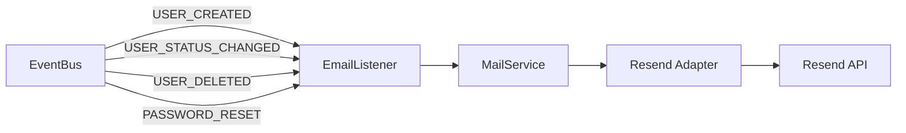

# Email Module

## 1. Responsibility

The **Email** module handles all outgoing electronic communications. It is designed to be a generic utility that can be swapped or modified without affecting the core business domains.

| Goal                       | Description                                                                      |
| -------------------------- | -------------------------------------------------------------------------------- |
| **Communication Delivery** | Send transactional emails (Verification, Password Reset, Account Status Updates) |
| **Template Management**    | Encapsulate HTML/Text templates (English) for different email types              |
| **Provider Decoupling**    | Abstract specific email services (Resend) via interfaces                         |

---

### System Architecture (Email Module)



---

## 2. Dependencies

### Implementation Details

The module uses the Adapter pattern to decouple the logic from the email provider.

| Dependency         |    Interface    | Implementation (Infra) | Purpose                                         |
| :----------------- | :-------------: | :--------------------: | :---------------------------------------------- |
| **Email Provider** | `IEmailService` |  `ResendMailService`   | Handles API calls to **Resend** to send emails. |

---

## 3. Core Logic Flows

### 3.1 Verification Email

- **Trigger**: Called by `AuthService` during registration or via resend request.
- **Payload**: User email and a verification token.
- **Template**: `registrationTemplate`.

### 3.2 Reset Password Email

- **Trigger**: Called by `AuthService` during forgot password flow.
- **Payload**: User email and a reset token.
- **Template**: `password_reset`.

### 3.3 Account Status Notifications

- **Trigger**: Called by `EmailListener` on `USER_STATUS_CHANGED` or `USER_DELETED`.
- **Payload**: User email, name, and new status.
- **Template**: `account_status`.
- **Localization**: Standardized on English templates for all account updates (ACTIVE, BANNED, DEACTIVE, DELETED).

---

## 4. Configuration

Required Environment Variables:

- `EMAIL_API_KEY`: API key for the Resend service.
- `RESEND_FROM_EMAIL`: Authorized sender email.
- `CLIENT_HOST`: Host URL for the frontend (used for links).
- `PROJECT_NAME`: Display name of the project.

---

## 5. Testing

Unit tests cover:

- Successful delivery logic for verification, reset, and status updates.
- Template parameter mapping (including `isActive`, `isBanned`, etc. flags).
- English subject line mapping.
- Error handling for missing configurations.
- Error handling for provider API failures.

Run tests:

```bash
npm run test:unit -- src/modules/emails/
```
