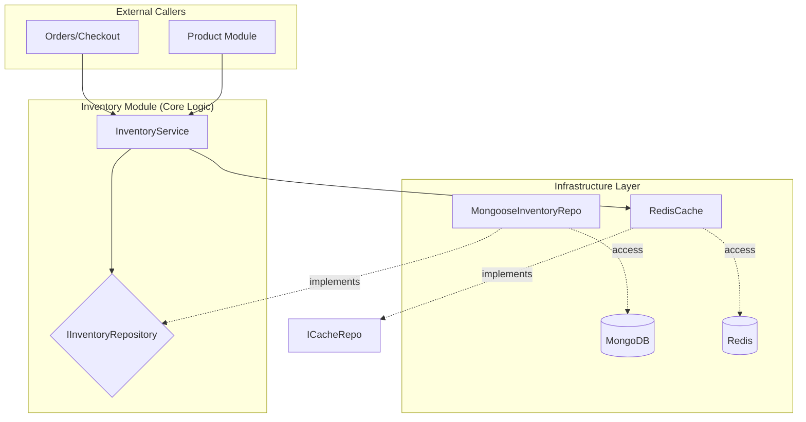
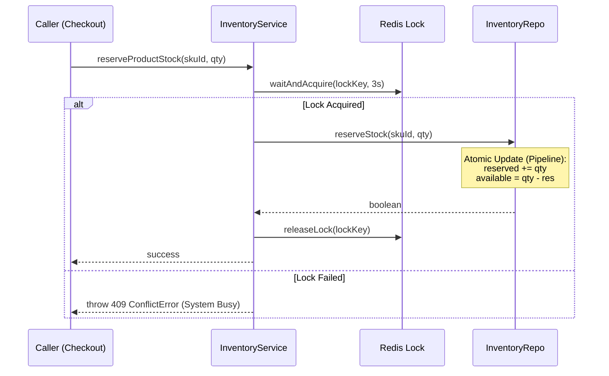

# Inventory Module

## 1. Responsibility

The **Inventory** module is a standalone service dedicated to high-performance stock management. It acts as the guardian of physical availability, ensuring atomic updates and preventing overselling.

| Goal                          | Description                                                                                |
| ----------------------------- | ------------------------------------------------------------------------------------------ |
| **Stock Tracking**            | Real-time monitoring of `quantity`, `reserved`, and `available` counts.                    |
| **Atomic Reservations**       | Thread-safe stock locking during checkout using Redis Distributed Locks.                   |
| **Transactional Consistency** | Using MongoDB Update Pipelines to ensure `available = quantity - reserved` is always true. |
| **Restocking**                | Admin APIs for manual inventory adjustments and threshold alerts.                          |

---

## 2. Dependencies

| Dependency       |       Interface        | Implementation (Infra)  | Purpose                                            |
| :--------------- | :--------------------: | :---------------------: | :------------------------------------------------- |
| **Database**     | `IInventoryRepository` | `MongooseInventoryRepo` | Data persistence on **MongoDB**.                   |
| **Caching/Lock** |      `ICacheRepo`      |      `RedisCache`       | Prevents race conditions during stock reservation. |

---

## 3. System Architecture



---

## 4. Detailed Logic Flows

### 4.1 Stock Reservation (Locking Flow)

This flow ensures that when a user starts checkout, the stock is "locked" so no other user can take it, even if dozens of concurrent requests arrive.



- **Wait Time:** 3000ms to handle high concurrency.
- **TTL:** 5000ms to prevent deadlocks in case of process failure.

---

### 4.2 Automated Availability Sync

The module never calculates availability in memory. It uses database-level pipelines to ensure truth:

```javascript
// Database-level Pipeline (Atomic)
{
  $set: {
    quantity: { $add: ["$quantity", amount] },
    available: { $subtract: [{ $add: ["$quantity", amount] }, "$reserved"] }
  }
}
```

---

## 5. Technical Design

### 5.1 Data Schema (Mongoose Model)

Based on `mongoose-inventory.model.ts`.

| Field               | Type     | Required | Description                                |
| ------------------- | -------- | :------: | ------------------------------------------ |
| `skuId`             | ObjectId |   Yes    | Unique reference to SKU                    |
| `quantity`          | Number   |   Yes    | Total physical stock (default 0)           |
| `reserved`          | Number   |   Yes    | Stock in active checkout sessions          |
| `available`         | Number   |   Yes    | Sellable stock (`quantity - reserved`)     |
| `lowStockThreshold` | Number   |    No    | Trigger for restocking alerts (default 10) |
| `location`          | String   |    No    | Warehouse location / bin number            |
| `deletedAt`         | Date     |    No    | Soft delete timestamp                      |

---

### 5.2 Response Examples

#### Inventory Detail

```json
{
  "skuId": "65d4...",
  "quantity": 100,
  "reserved": 5,
  "available": 95,
  "lowStockThreshold": 10,
  "location": "A1-B2",
  "updatedAt": "2024-02-21T..."
}
```

---

## 6. Business Exceptions

| Error Code            | HTTP Status | Description                                   |
| :-------------------- | :---------: | :-------------------------------------------- |
| `STOCK_INSUFFICIENT`  |     400     | Requested quantity exceeds `available` count. |
| `INVENTORY_NOT_FOUND` |     404     | Record missing for the given SKU ID.          |
| `SYSTEM_BUSY`         |     409     | Failed to acquire Redis lock within timeout.  |
| `ALREADY_DELETED`     |     410     | Inventory record has been soft-deleted.       |

---

## 7. Test Cases

### Happy Path

|  #  | Case             | Input                    | Expected Result                             |
| :-: | ---------------- | ------------------------ | ------------------------------------------- |
|  1  | Create Inventory | New SKU ID + initial qty | 201, Record created with `available = qty`. |
|  2  | Reserve Stock    | `skuId`, `quantity: 5`   | 200, `reserved` +5, `available` -5.         |
|  3  | Confirm Sale     | `skuId`, `quantity: 5`   | 200, `quantity` -5, `reserved` -5.          |
|  4  | Release Stock    | `skuId`, `quantity: 5`   | 200, `reserved` -5, `available` +5.         |
|  5  | Add/Update Stock | `skuId`, `amount: +20`   | 200, `quantity` +20, `available` +20.       |
|  6  | Find by SKU      | Valid `skuId`            | 200, Returns InventoryEntity.               |

### Edge Cases & Errors

|  #  | Case                  | Input                | Expected Result                                              |
| :-: | --------------------- | -------------------- | ------------------------------------------------------------ |
|  1  | Insufficient Stock    | `qty > available`    | 400, `STOCK_INSUFFICIENT`.                                   |
|  2  | High Concurrency      | 50+ parallel reqs    | 409, `SYSTEM_BUSY` (Redis lock wait timeout).                |
|  3  | Negative Reservation  | `qty: -10`           | 400, Validation error.                                       |
|  4  | Release Too Much      | `qty > reserved`     | 400, DB pipeline prevents negative `reserved` count.         |
|  5  | SKU Not Found         | Fake `skuId`         | 404, `INVENTORY_NOT_FOUND`.                                  |
|  6  | Atomic Sync Violation | Manual DB edit       | System recovers on next update via `$set: { available: ...}` |
|  7  | Lock Release Failure  | Process crash mid-op | Redis TTL (5s) automatically releases lock.                  |
|  8  | Soft Deleted SKU      | Deleted `skuId`      | 404, Inventory ignored/hidden by query filters.              |
|  9  | Confirm > Reserved    | `qty: 10`, `res: 5`  | 400, Pipeline prevents negative `reserved` during confirm.   |
| 10  | Idempotent Create     | Existing `skuId`     | 409, `INVENTORY_ALREADY_EXISTS`.                             |

---

## 8. Resilience & Data Integrity

### 8.1 Multi-Layer Protection

The module employs a "Defense in Depth" strategy to prevent overselling:

1.  **Layer 1 (Redis Distributed Lock):** Prevents race conditions at the application level by serializing requests for the same SKU.
2.  **Layer 2 (MongoDB Atomic Update):** The ultimate source of truth. Every reservation uses a conditional update (`$expr` with `$gte`) to ensure stock never drops below zero, even if the Redis lock layer is bypassed or fails.

### 8.2 Natural Fallback

While `InventoryService` currently treats Redis as a primary gate, the **MongoDB layer is sufficient on its own** to maintain data integrity. If Redis becomes unavailable, the system can be configured to bypass the lock and rely solely on MongoDB's atomic conditional updates to guarantee that no more than the available quantity is ever reserved.

---
