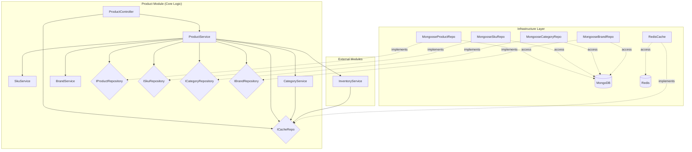
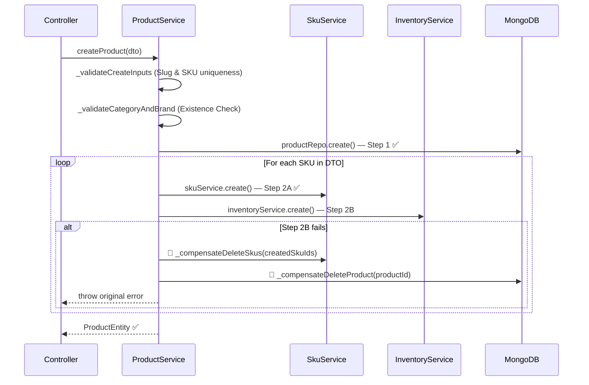
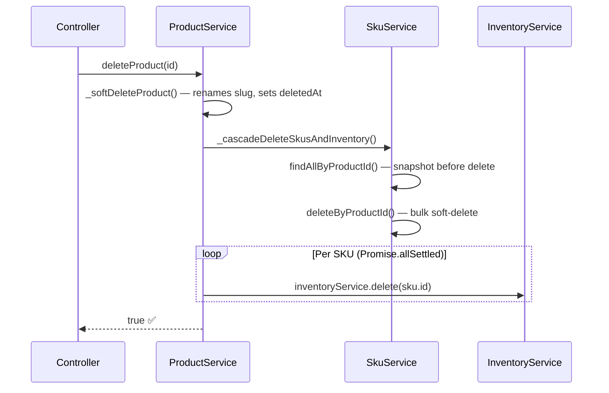
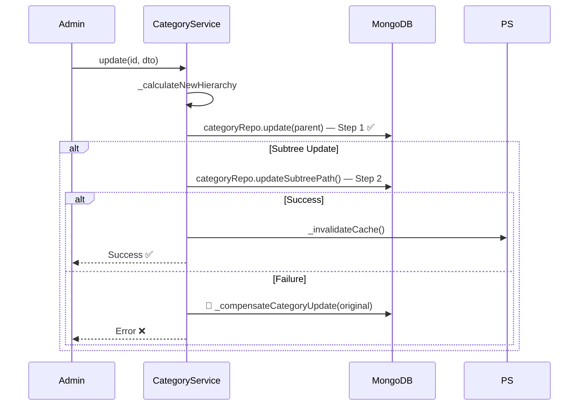
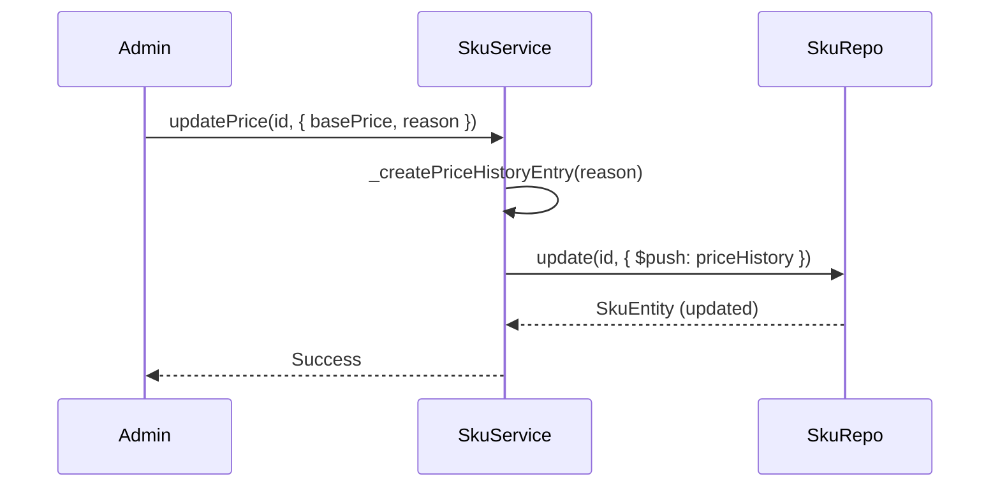

# Product Module

## 1. Responsibility

The **Product** module manages the core catalog of the e-commerce system, including products, variants (SKUs), categories, and brands. Its primary goals are:

| Goal                       | Description                                                                            |
| -------------------------- | -------------------------------------------------------------------------------------- |
| **Catalog Management**     | CRUD operations for Products, Categories, and Brands.                                  |
| **Variant Strategy (SKU)** | Management of multiple SKUs per product with unique attributes and pricing.            |
| **Integrations**           | Coordination with the **Inventory Module** for stock tracking during product creation. |
| **Hierarchy Management**   | ID-based Materialized Path pattern with automated path calculation.                    |
| **High Performance**       | Slug indexing for fast lookups & Fragment Caching with Redis for <1ms navigation.      |
| **Data Integrity**         | Separate Move API with Subject-Descendant atomic updates and automatic rollback.       |
| **Price Auditing**         | Tracking all price movements via a mandatory `priceHistory` log.                       |
| **Standardized Errors**    | Unified `asyncHandler` and `ErrorResponse` patterns for predictable API behavior.      |

---

## 2. Dependencies

### Infrastructure & Patterns

| Dependency       |                         Interface                         |   Implementation (Infra)    | Purpose                                             |
| :--------------- | :-------------------------------------------------------: | :-------------------------: | :-------------------------------------------------- |
| **Database**     | `IProductRepo`, `ISkuRepo`, `ICategoryRepo`, `IBrandRepo` | `MongooseProductRepo`, etc. | Data persistence on **MongoDB**.                    |
| **Caching**      |                       `ICacheRepo`                        |        `RedisCache`         | Fragment caching and Locking.                       |
| **Integrations** |                    `InventoryService`                     |       External Module       | Orchestrates stock records for new SKUs.            |
| **Soft Delete**  |                     Manual Filtering                      |     Repository queries      | Ensures `deletedAt` records are ignored by default. |

---

## 3. System Architecture



---

## 4. Detailed Logic Flows

### 4.1 Product Creation — Compensating Transaction Flow

Creating a product initializes SKUs and triggers the creation of respective inventory records in the **Inventory Module**. To guarantee atomicity **without requiring a MongoDB Replica Set**, we use the **Compensating Transaction (Saga)** pattern:

- If SKU or Inventory creation fails at any point, previously created records are **hard-deleted** to prevent orphan data.
- Compensation is handled by private methods inside `ProductService` only — never exposed via the public API.



- **Uniqueness:** Product slug and all SkuCodes are verified before any record is written.
- **Compensation:** `_compensateDeleteProduct` and `_compensateDeleteSkus` are `private` methods — part of `ProductService` only.
- **`hardDelete`**: Used exclusively in compensation — `IProductRepository.hardDelete()` and `ISkuRepository.hardDelete()` are documented as "compensation-only" in their interfaces.

---

### 4.1b Product Deletion — Cascade Soft-Delete Flow

Deletion cascades from Product → SKUs → Inventory. Each step is **idempotent** (safe to retry).



- **Idempotent:** `Promise.allSettled` ensures all inventory deletes are attempted; partial failures are logged, not thrown.

---

### 4.2 Category Hierarchy — Pure Materialized Path & Rollback

- **Storage:** `path` string consisting of comma-separated MongoDB IDs (e.g., `,65d4...,65d5...,`).
- **ID-based Strategy:** Using IDs instead of slugs in the path ensures that changing a category's name or slug **does not** require updating its descendants' paths. This significantly reduces database write overhead for common metadata updates.
- **Fast Lookups:** `slug` fields are fully **indexed**, allowing standard find-by-slug operations to remain highly performant while keeping the tree structure stable.
- **Zero Recursion:** Materialized Path enables fetching an entire subtree or ancestor chain in a **single query** using standard string prefixes/regex, eliminating recursive "parent-by-parent" lookups.
- **Atomic Bulk Update:** Moving a subtree involves string replacement on the `path` for all descendants using Regex.
- **Rollback (Compensating Transaction):** Update operations follow an atomic flow to ensure data integrity when moving subtrees:
  1. Calculate new hierarchy (path/level).
  2. Update Subject Category in DB.
  3. Update all Descendants (Path replacement).
  4. If Step 3 fails, the Subject Category is **rolled back** to its original state.



> [!NOTE]
> Moving a category is an expensive operation (O(n) where n is the number of descendants). This is an acceptable **trade-off** as tree reorganizations are rare in production. The UI provides warnings before execution.

---

### 4.2b Performance — Incremental Fragment Caching

To ensure sub-millisecond response times for category navigation, we implement **Incremental Fragment Caching**:

- **Cache-Aside Pattern:** Segments of the category list are cached on-demand.
- **Discovery Strategy:** Caches the top **20 Level 1** categories along with the top **20 Level 2** children for each (`cat:discovery`). This ensures the primary navigation menu is instant.
- **JIT (Just-In-Time) Population:** When a user explores a deeper path or a specific filter that isn't in the Discovery cache, the system fetches the data and populates a new fragment cache (`cat:list:*`).
- **Key Strategy:** `cat:list:{path}:{page}:{limit}:{keyword}`.
- **Automatic Invalidation:** Any mutation (Create/Update/Delete/Move) triggers a broad invalidation (`deleteByPattern: cat:*`).

### 4.3 SKU Price History (Audit Trail)

Price changes are never direct overwrites. They require a `reason` and are logged to a history array.



---

## 5. Data Guarding & Integrity

### 5.1 Soft Delete Implementation

Every repository method (`findById`, `findBySlug`, `findAll`) includes an implicit filter: `{ deletedAt: null }`.

- **Safety:** Users and APIs cannot see or interact with deleted products.
- **Uniqueness:** Upon deletion, slugs and SkuCodes are renamed (e.g., `code-deleted-TIMESTAMP`) to free up the unique index.

### 5.2 Usage Constraints

- **Category/Brand:** Cannot be deleted if referenced by any active products.
- **SKU:** A product must always have at least one SKU.

---

## 6. Technical Design

### 6.1 Data Schema (Mongoose Models)

#### I. Product

| Field        | Type     | Required | Description                          |
| ------------ | -------- | :------: | ------------------------------------ |
| `name`       | String   |   Yes    | Product name                         |
| `slug`       | String   |   Yes    | Unique SEO URL                       |
| `brandId`    | ObjectId |   Yes    | Reference to Brand                   |
| `categoryId` | ObjectId |   Yes    | Reference to Category                |
| `status`     | String   |   Yes    | `DRAFT`, `PUBLISHED`, `OUT_OF_STOCK` |
| `avgRating`  | Number   |    No    | Calculated from reviews              |
| `version`    | Number   |   Yes    | Optimistic Lock counter              |

#### II. SKU

| Field             | Type     | Required | Description                          |
| ----------------- | -------- | :------: | ------------------------------------ |
| `productId`       | ObjectId |   Yes    | Reference to Parent Product          |
| `skuCode`         | String   |   Yes    | Unique identifier (IP15-BLUE-256)    |
| `attributes`      | Array    |   Yes    | key, value, label (e.g., Color, RAM) |
| `price.basePrice` | Number   |   Yes    | Current listing price                |
| `priceHistory`    | Array    |    No    | Audit log of all price changes       |

#### III. Category

| Field         | Type      | Required | Description                                           |
| ------------- | --------- | :------: | ----------------------------------------------------- |
| `name`        | String    |   Yes    | Category name                                         |
| `slug`        | String    |   Yes    | Unique SEO URL                                        |
| `path`        | String    |   Yes    | Pure Materialized path (e.g., `,electronics,phones,`) |
| `level`       | (Virtual) |    No    | Computed dynamically from `path`. Not stored.         |
| `status`      | String    |   Yes    | `PUBLISHED`, `HIDDEN`, `DRAFT`, `DISCONTINUED`        |
| `description` | String    |    No    | Category description                                  |
| `icon`        | String    |    No    | Lucide icon name or image URL                         |
| `version`     | Number    |   Yes    | Optimistic Lock counter                               |

---

### 6.2 Validation Rules

| Field       | Target   | Constraints | Error Code               |
| ----------- | -------- | ----------- | ------------------------ |
| `slug`      | Product  | Unique      | `PRODUCT_SLUG_EXISTS`    |
| `skuCode`   | SKU      | Unique      | `SKU_CODE_EXISTS`        |
| `level`     | Category | `<= 5`      | `MAX_DEPTH_REACHED`      |
| `path`      | Category | Unique      | Root path uniqueness     |
| `basePrice` | SKU      | `> 0`       | `PRICE_MUST_BE_POSITIVE` |

---

### 6.3 Response Examples

#### I. Product Details (Paginated)

```json
{
  "data": [
    {
      "id": "65d4b...",
      "name": "iPhone 15 Pro",
      "slug": "iphone-15-pro",
      "status": "PUBLISHED",
      "avgRating": 4.8,
      "brandId": "...",
      "categoryId": "..."
    }
  ],
  "pagination": { "totalElements": 120, "totalPages": 12, "currentPage": 1 }
}
```

---

## 7. Business Exceptions

| Error Code                   | HTTP Status | Description                                      |
| :--------------------------- | :---------: | :----------------------------------------------- |
| `PRODUCT_NOT_FOUND`          |     404     | Record is missing or soft-deleted.               |
| `PRODUCT_SLUG_EXISTS`        |     409     | Slug is already taken by another active product. |
| `MAX_DEPTH_REACHED`          |     400     | Category hierarchy exceeds 5 levels.             |
| `CIRCLE_DEPENDENCY`          |     400     | (Deprecated)                                     |
| `CATEGORY_IN_USE`            |     409     | Cannot delete category with active products.     |
| `INVALID_SKU_DATA`           |     400     | Missing required attributes or invalid price.    |
| `DATA_MODIFIED_CONCURRENTLY` |     409     | Stale `version` during optimistic-lock update.   |

---

## 8. Test Cases

### Happy Path

|  #  | Case                | Input                      | Expected Result                                            |
| :-: | ------------------- | -------------------------- | ---------------------------------------------------------- |
|  1  | Create Product      | Valid DTO + SKUs           | 201, Product, SKUs & Inventory created.                    |
|  2  | Find by ID/Slug     | Valid ID or Slug           | 200, Returns ProductEntity, filters deletedAt.             |
|  3  | Search & Filter     | categoryId, brandId, query | 200, PaginatedResult with filtered data.                   |
|  4  | Update Product      | Valid fields + correct ver | 200, Basic fields updated, version remains or inc.         |
|  5  | Update Price        | New price + reason         | 200, `priceHistory` contains new entry (audited).          |
|  6  | (Deprecated)        | -                          | -                                                          |
|  7  | Soft Delete Product | Active ID                  | 204, Product/SKU/Inventory `deletedAt` set, slugs renamed. |
|  8  | List Categories     | -                          | 200, Returns paginated fragments (Redis Cached).           |
|  9  | Find Category Path  | Valid Path                 | 200, Returns CategoryEntity by its path.                   |
| 10  | Move Subtree        | New parentPath             | 200, Cascades path updates to all children + Invalidate.   |
| 11  | Create Brand        | Valid BrandDTO             | 201, Brand created.                                        |
| 12  | List Brands         | -                          | 200, Returns all brands.                                   |
| 13  | Update Brand        | Valid fields               | 200, Brand info updated.                                   |
| 14  | Soft Delete Brand   | Active ID                  | 200, Brand `deletedAt` set, slug renamed.                  |

### Edge Cases & Errors

|  #  | Case                   | Input                 | Expected Result                                           |
| :-: | ---------------------- | --------------------- | --------------------------------------------------------- |
|  1  | Duplicate slug         | Existing slug         | 409, `PRODUCT_SLUG_EXISTS`.                               |
|  2  | Duplicate SkuCode      | Existing SKU in DTO   | 409, `SKU_CODE_EXISTS`.                                   |
|  3  | Invalid References     | Fake Category/Brand   | 404, `CATEGORY_NOT_FOUND` or `BRAND_NOT_FOUND`.           |
|  4  | Orphan Prevention (1)  | SKU creation fails    | 500, Product hard-deleted (Compensate Step 1).            |
|  5  | Orphan Prevention (2)  | Inventory fails       | 500, Product & SKUs hard-deleted (Compensate Step 1 & 2). |
|  6  | Concurrent Update      | Stale `version`       | 409, `DATA_MODIFIED_CONCURRENTLY`.                        |
|  7  | Max Depth Category     | Path level > 5        | 400, `MAX_DEPTH_REACHED`.                                 |
|  8  | (Deprecated)           | -                     | -                                                         |
|  9  | Delete Category in Use | Assigned to product   | 409, `CATEGORY_IN_USE`.                                   |
| 10  | Negative Price         | `basePrice: -100`     | 400, `PRICE_MUST_BE_POSITIVE`.                            |
| 11  | Fetch Deleted          | Deleted ID/Slug       | 404, `PRODUCT_NOT_FOUND` (automatic filtering).           |
| 12  | Re-use Deleted Slug    | Old slug after delete | 201, Success (original slug was renamed on delete).       |
| 13  | Slug Conflict Update   | Update to existing    | 409, `PRODUCT_SLUG_EXISTS` (across different IDs).        |
| 14  | Move Category Circle   | Parent is descendant  | 400, `CIRCLE_DEPENDENCY` / Descendant cannot be parent.   |
| 15  | Move Category Self     | Parent is self        | 400, Category cannot be its own parent.                   |
| 16  | Delete Brand in Use    | Assigned to product   | 409, `BRAND_IN_USE`.                                      |

---
