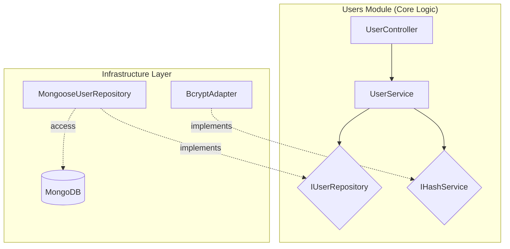
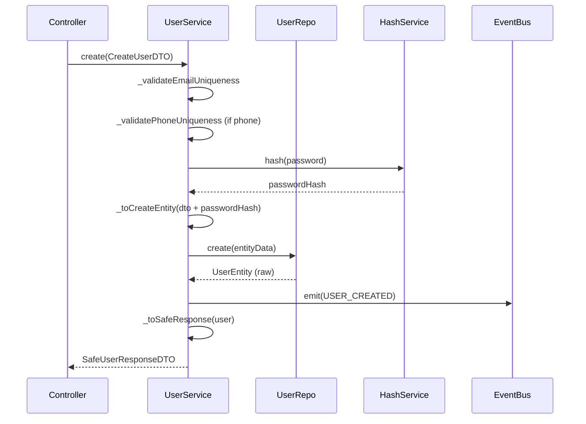
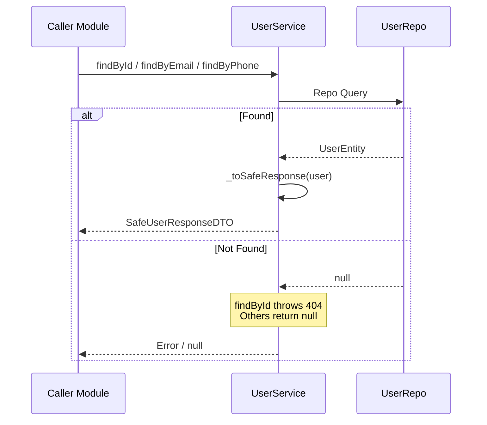
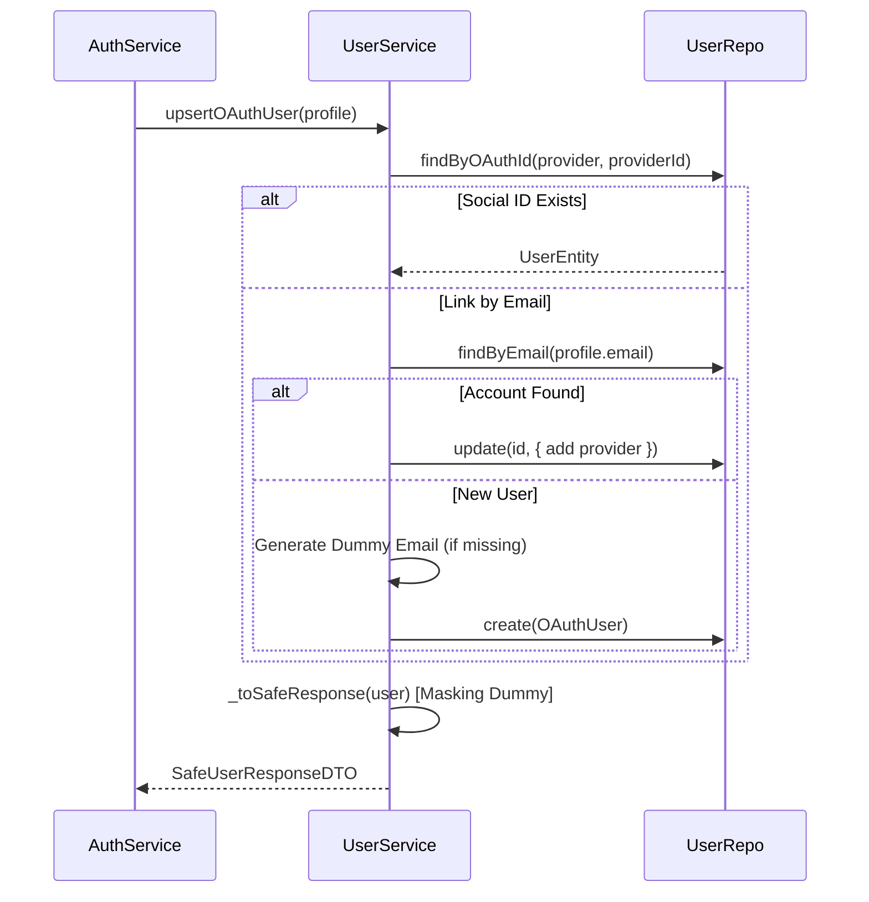
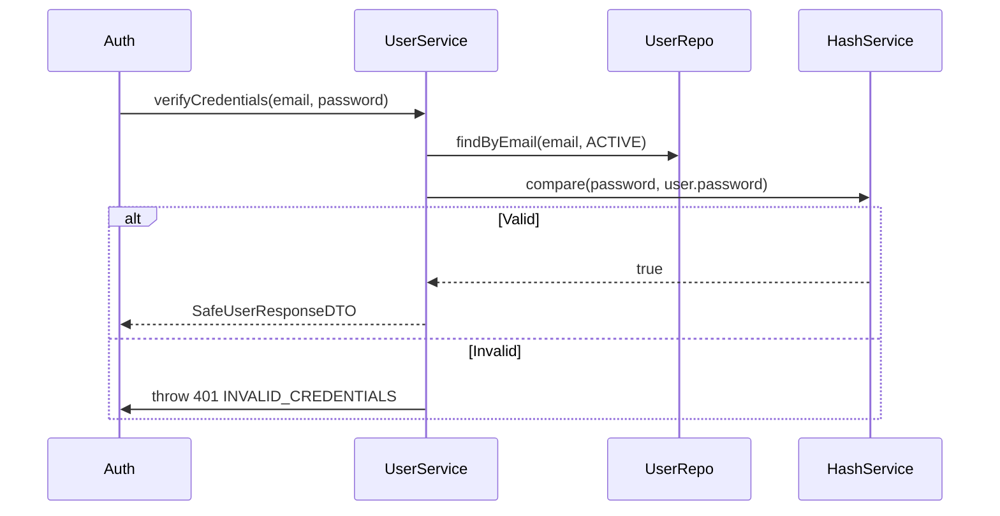
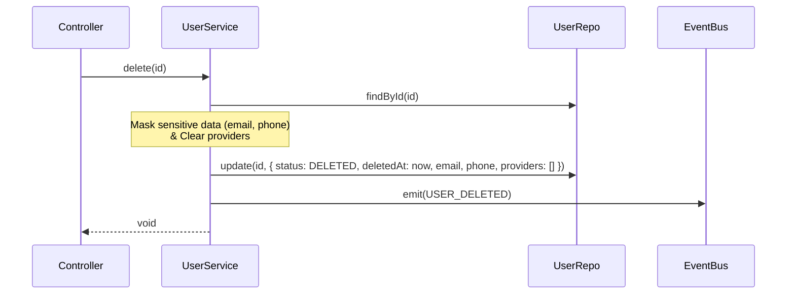
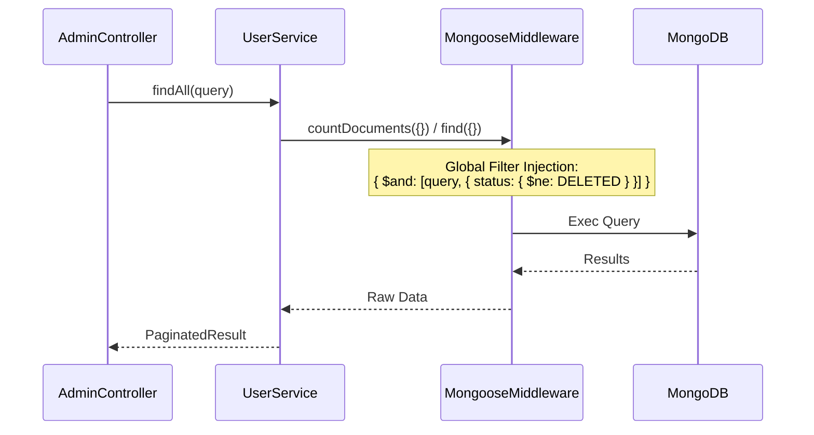
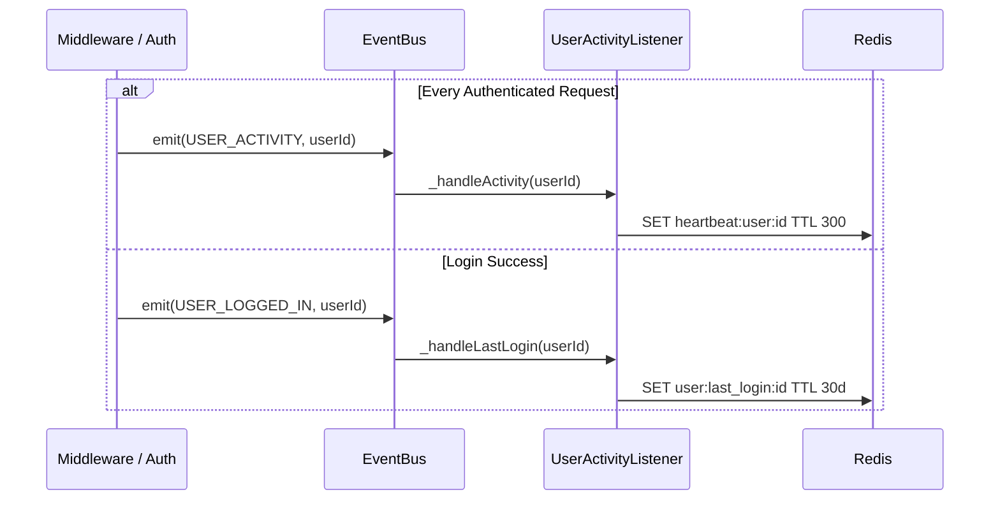
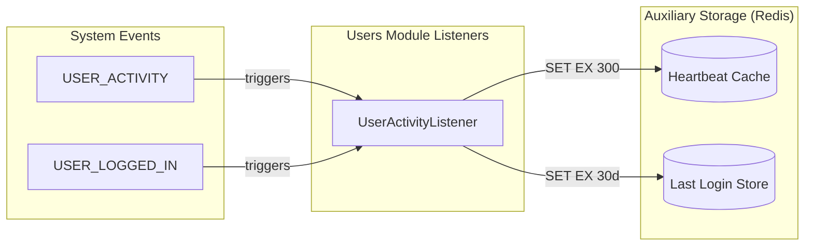

# Users Module

## 1. Responsibility

The **Users** module owns all user lifecycle operations and identity data. Its boundaries and goals are:

| Goal                        | Description                                                                                 |
| --------------------------- | ------------------------------------------------------------------------------------------- |
| **User CRUD**               | Create, read (findById, findByEmail, findAll), update profile, and manage account status    |
| **Identity Federation**     | Handle OAuth-based identities (Google, Facebook) and link them to local accounts            |
| **Credential Verification** | Verify email/password pairs for traditional authentication flows                            |
| **Identity Uniqueness**     | Enforce unique email and phone across the system, including social links                    |
| **Data Security**           | Ensure sensitive data (passwords, dummy emails) are never exposed via Safe Response mapping |

---

## 2. Dependencies

### Infrastructure & Implementation Dependencies

Decoupling of business logic from technical details using the Repository and Adapter patterns.

| Dependency       |     Interface     |  Implementation (Infra)  | Purpose                                                                |
| :--------------- | :---------------: | :----------------------: | :--------------------------------------------------------------------- |
| **Database**     | `IUserRepository` | `MongooseUserRepository` | Handles user data persistence and queries on **MongoDB**.              |
| **Hash Service** |  `IHashService`   |     `BcryptAdapter`      | Manages password security through `hash()` and `compare()` operations. |
| **Event Bus**    |    `EventBus`     |   `Node EventEmitter`    | Notifies other modules (e.g., Email) of user lifecycle events.         |

---

### System Architecture (Users Module)


```mermaid
flowchart TD
    subgraph Core["Users Module (Core Logic)"]
        direction TB
        UC[UserController]
        US[UserService]
        UR{IUserRepository}
        IHS{IHashService}
    end

    subgraph Infra["Infrastructure Layer"]
        direction LR
        MUR[MongooseUserRepository]
        BHA[BcryptAdapter]
        DB[(MongoDB)]
    end

    %% Main business flow
    UC --> US
    US --> UR
    US --> IHS

    %% Dependency Inversion (Realization)
    MUR -. "implements" .-> UR
    BHA -. "implements" .-> IHS

    %% External Data Access
    MUR -. "access" .-> DB
```

---

## 3. Detailed Logic Flows

### 3.1 Create User (Traditional)


```mermaid
sequenceDiagram
    participant C as Controller
    participant S as UserService
    participant R as UserRepo
    participant H as HashService
    participant EB as EventBus

    C->>S: create(CreateUserDTO)
    S->>S: _validateEmailUniqueness
    S->>S: _validatePhoneUniqueness (if phone)
    S->>H: hash(password)
    H-->>S: passwordHash
    S->>S: _toCreateEntity(dto + passwordHash)
    S->>R: create(entityData)
    R-->>S: UserEntity (raw)
    S->>EB: emit(USER_CREATED)
    S->>S: _toSafeResponse(user)
    S-->>C: SafeUserResponseDTO
```

- **Uniqueness:** Email and Phone (if provided) are checked against the DB before creation.
- **Status:** New users are initiated with `status: ACTIVE` but `isVerified: false`.
- **Security:** Passwords are never stored in plain text.

---

### 3.2 Identity Queries (Find by Unique Field)

These methods provide flexible lookups for internal and external modules.


```mermaid
sequenceDiagram
    participant M as Caller Module
    participant S as UserService
    participant R as UserRepo

    M->>S: findById / findByEmail / findByPhone
    S->>R: Repo Query
    alt Found
        R-->>S: UserEntity
        S->>S: _toSafeResponse(user)
        S-->>M: SafeUserResponseDTO
    else Not Found
        R-->>S: null
        Note over S: findById throws 404<br/>Others return null
        S-->>M: Error / null
    end
```

- **`findById`**: Throws `USER_NOT_FOUND` if the record is missing.
- **`findByEmail` / `findByPhone`**: Return `null` to allow callers to handle missing records gracefully (e.g., during login or uniqueness checks).

---

### 3.3 OAuth Identity Sync (`upsertOAuthUser`)

Handles Social Login identities from Google, Facebook, etc.


```mermaid
sequenceDiagram
    participant AS as AuthService
    participant S as UserService
    participant R as UserRepo

    AS->>S: upsertOAuthUser(profile)
    S->>R: findByOAuthId(provider, providerId)
    alt Social ID Exists
        R-->>S: UserEntity
    else Link by Email
        S->>R: findByEmail(profile.email)
        alt Account Found
            S->>R: update(id, { add provider })
        else New User
            S->>S: Generate Dummy Email (if missing)
            S->>R: create(OAuthUser)
        end
    end
    S->>S: _toSafeResponse(user) [Masking Dummy]
    S-->>AS: SafeUserResponseDTO
```

- **Dummy Email Mechanism:** If the provider doesn't supply an email, the system generates one (e.g., `facebook_123@atomecom.dummy`) to satisfy DB unique constraints.
- **Masking:** When returning data to the client, if `isEmailMissing` is true, the `email` field is forced to `null`. This signals the Frontend to prompt the user for a valid email.

---

### 3.4 Verify Credentials

Used by the **Auth Module** during local login.


```mermaid
sequenceDiagram
    participant A as Auth
    participant S as UserService
    participant R as UserRepo
    participant H as HashService

    A->>S: verifyCredentials(email, password)
    S->>R: findByEmail(email, ACTIVE)
    S->>H: compare(password, user.password)
    alt Valid
        H-->>S: true
        S-->>A: SafeUserResponseDTO
    else Invalid
        S->>A: throw 401 INVALID_CREDENTIALS
    end
```

---

### 3.5 Profile & Account Updates

All update methods use **Optimistic Locking** via the `version` field to prevent concurrent data loss.

| Method                | Purpose                 | Side Effects                                                                                  |
| :-------------------- | :---------------------- | :-------------------------------------------------------------------------------------------- |
| `changePassword`      | Update Bcrypt hash      | Increments version                                                                            |
| `changeEmail`         | Update email address    | Resets `isVerified: false`, `isEmailMissing: false`                                           |
| `changePhone`         | Update phone contact    | Increments version                                                                            |
| `updateStatusAccount` | Change account state    | `ACTIVE`, `BANNED`, etc.                                                                      |
| `verifyAccount`       | Set email verified flag | Typically called by Auth Module                                                               |
| `delete`              | Soft delete account     | Updates `status: DELETED`, masks Email/Phone, clears Social Providers to free up unique index |

#### Soft Delete Workflow


```mermaid
sequenceDiagram
    participant C as Controller
    participant S as UserService
    participant R as UserRepo
    participant EB as EventBus

    C->>S: delete(id)
    S->>R: findById(id)
    Note over S: Mask sensitive data (email, phone)<br/>& Clear providers
    S->>R: update(id, { status: DELETED, deletedAt: now, email, phone, providers: [] })
    S->>EB: emit(USER_DELETED)
    S-->>C: void
```

---

### 3.6 Find All (Admin / Search)

Transforms complex queries into paginated results.

1. **Mapping:** Converts page/limit into offset/limit.
2. **Filtering:** Supports `status`, `role`, and `keyword` search.
3. **Global Protection:** Automatically excludes users with `DELETED` status or `deletedAt != null` via Model-level Mongoose Middleware. Use cases do not need to handle filtering manually.
4. **Response:** Encapsulates the results in a `PaginatedResult` object with metadata.

#### Admin Search Workflow


```mermaid
sequenceDiagram
    participant C as AdminController
    participant S as UserService
    participant M as MongooseMiddleware
    participant DB as MongoDB

    C->>S: findAll(query)
    S->>M: countDocuments({}) / find({})
    Note over M: Global Filter Injection:<br/>{ $and: [query, { status: { $ne: DELETED } }] }
    M->>DB: Exec Query
    DB-->>M: Results
    M-->>S: Raw Data
    S-->>C: PaginatedResult
```

---

### 3.7 Activity & Heartbeat Tracking (EDA)

The Users module includes a `UserActivityListener` that responds to system-wide events to track user presence without direct coupling.

#### I. Real-time Heartbeat (`_handleActivity`)

- **Event**: `USER_ACTIVITY` (emitted by `authMiddleware`).
- **Logic**: Updates a Redis key `heartbeat:user:{userId}` with a **5-minute TTL**.
- **Purpose**: Provides a high-performance "Active Now" count by querying the number of active Redis keys.

#### II. Last Login Tracking (`_handleLastLogin`)

- **Event**: `USER_LOGGED_IN` (emitted by `AuthService` on login/oauth).
- **Why Redis?**: To avoid database versioning (`__v`) conflicts and optimize performance for frequent logins.

#### Tracking Sequence


```mermaid
sequenceDiagram
    participant FW as Middleware / Auth
    participant EB as EventBus
    participant L as UserActivityListener
    participant R as Redis

    alt Every Authenticated Request
        FW->>EB: emit(USER_ACTIVITY, userId)
        EB->>L: _handleActivity(userId)
        L->>R: SET heartbeat:user:id TTL 300
    else Login Success
        FW->>EB: emit(USER_LOGGED_IN, userId)
        EB->>L: _handleLastLogin(userId)
        L->>R: SET user:last_login:id TTL 30d
    end
```

---

### 3.8 Event Driven Architecture (EDA Flow)

The diagram below describes how the Users Module listens to system events to update data asynchronously.


```mermaid
flowchart LR
    subgraph Events["System Events"]
        UA[USER_ACTIVITY]
        ULI[USER_LOGGED_IN]
    end

    subgraph Listeners["Users Module Listeners"]
        UAL[UserActivityListener]
    end

    subgraph Storage["Auxiliary Storage (Redis)"]
        HB[(Heartbeat Cache)]
        LL[(Last Login Store)]
    end

    UA -- "triggers" --> UAL
    ULI -- "triggers" --> UAL

    UAL -- "SET EX 300" --> HB
    UAL -- "SET EX 30d" --> LL
```

- **USER_ACTIVITY**: Triggered on every user interaction (via Middleware).
- **USER_LOGGED_IN**: Triggered immediately upon successful login.
- **Decoupling**: Online status and Last Login recording are separated from the main DB flow to ensure maximum response speed.

---

## 4. Technical Design

### 4.1 Data Schema

Based on `mongoose-user.model.ts`.

| Field            | Type    | Required | Description                                                       |
| ---------------- | ------- | :------: | ----------------------------------------------------------------- |
| `name`           | String  |   Yes    | User display name                                                 |
| `email`          | String  |   Yes    | Unique; may be a dummy for placeholder OAuth                      |
| `avatar`         | String  |    No    | URL to profile picture (Gravatar or OAuth source)                 |
| `password`       | String  |    No    | Bcrypt hash (Optional for pure social accounts)                   |
| `role`           | Enum    |   Yes    | `USER_ROLE` (default `USER`)                                      |
| `providers`      | Array   |    No    | Linked social accounts (provider + providerId)                    |
| `status`         | String  |   Yes    | `ACTIVE`, `DEACTIVE`, `BANNED`, `DELETED`                         |
| `deletedAt`      | Date    |    No    | Timestamp for soft delete (Automatically filtered at Model level) |
| `isExternal`     | Boolean |    No    | Flag for accounts created via OAuth                               |
| `isEmailMissing` | Boolean |    No    | True if user needs to provide a real email                        |
| `isVerified`     | Boolean |    No    | Email verification flag                                           |
| `version`        | Number  |    No    | Optimistic locking counter; default `0`                           |

### 4.2 Auxiliary Data Schemas (Redis)

Inside the Users Module, real-time and fast-access data are managed on Redis to optimize performance.

| Key Pattern                | Data Type |   TTL   | Description                                                           |
| :------------------------- | :-------: | :-----: | :-------------------------------------------------------------------- |
| `heartbeat:user:{userId}`  | Timestamp | 5 Mins  | Marks the user as online (Active Now).                                |
| `user:last_login:{userId}` | JSON Obj  | 30 Days | Stores `{ timestamp, ip, userAgent }` for session history & displays. |

> [!TIP]
> **Why use Redis for Session Tracking?**
> Storing transient session data like IP and Device info in Redis avoids database bloat and audit-trail pollution. The 30-day TTL ensures history is available for admin review without permanent storage.

### 4.3 Validation Rules

Based on `user.validator.ts`.

| Field      | DTO    | Constraints | Error Code                                |
| ---------- | ------ | ----------- | ----------------------------------------- |
| `name`     | Create | `min(2)`    | `NAME_MUST_BE_AT_LEAST_2_CHARS`           |
| `email`    | Create | `email()`   | `INVALID_EMAIL_FORMAT`                    |
| `phone`    | Create | `min(10)`   | `PHONE_NUMBER_MUST_BE_AT_LEAST_10_DIGITS` |
| `password` | Create | `min(6)`    | `PASSWORD_MUST_BE_AT_LEAST_6_CHARS`       |
| `id`       | Params | `ObjectId`  | `INVALID_USER_ID`                         |

### 4.3 Safe Response (The Gatekeeper)

The private method `_toSafeResponse` acts as the final security gate for all User data:

1. **Strip Secret Fields:** Removes `password` and `__v`.
2. **Email Masking:** If `isEmailMissing: true`, returns `email: null` regardless of the dummy value in the DB.
3. **Immutability:** Returns a plain object, preventing accidental DB updates from the presentation layer.

### 4.4 Response Examples

#### I. Standard User (SafeUserResponseDTO)

```json
{
  "id": "507f1f77bcf86cd799439011",
  "name": "Jane Doe",
  "email": "jane.doe@example.com",
  "role": "user",
  "status": "active",
  "isVerified": true,
  "isExternal": false,
  "isEmailMissing": false,
  "version": 1,
  "createdAt": "2025-02-14T10:00:00.000Z",
  "updatedAt": "2025-02-14T10:00:00.000Z"
}
```

#### II. Masked OAuth User (No Email provided by Social Provider)

Notice `email` is `null` and `isEmailMissing` is `true`.

```json
{
  "id": "60b8d2951f2a430015f6a9c1",
  "name": "John Social",
  "email": null,
  "role": "user",
  "status": "active",
  "isVerified": false,
  "isExternal": true,
  "isEmailMissing": true,
  "version": 0
}
```

#### III. Paginated Result

```json
{
  "data": [
    { "id": "...", "name": "User 1", ... },
    { "id": "...", "name": "User 2", ... }
  ],
  "pagination": {
    "totalElements": 45,
    "totalPage": 5,
    "currentPage": 1,
    "elementsPerPage": 10
  }
}
```

## 5. Business Exceptions

Comprehensive list of error codes from `ErrorUserCodes`.

| Error Code                                | HTTP Status | Description                                     |
| ----------------------------------------- | :---------: | ----------------------------------------------- |
| **Business Logic**                        |             |                                                 |
| `USER_NOT_FOUND`                          |     404     | User does not exist or matches criteria         |
| `INVALID_CREDENTIALS`                     |     401     | Email or password mismatch (Verify Credentials) |
| `USER_ACCOUNT_LOCKED`                     |     403     | Attempt to access BANNED or DEACTIVE account    |
| `EMAIL_ALREADY_EXISTS`                    |     409     | Email taken by another account                  |
| `PHONE_ALREADY_EXISTS`                    |     409     | Phone taken by another account                  |
| `USER_DATA_MODIFIED_CONCURRENTLY`         |     409     | Version mismatch (Optimistic Lock Conflict)     |
| `INVALID_USER_ID`                         |     400     | The provided ID is not a valid ObjectId         |
| **Validation**                            |             |                                                 |
| `STREET_IS_REQUIRED`                      |     400     | Street field is missing or empty                |
| `CITY_IS_REQUIRED`                        |     400     | City field is missing or empty                  |
| `NAME_MUST_BE_AT_LEAST_2_CHARS`           |     400     | Display name is too short                       |
| `INVALID_EMAIL_FORMAT`                    |     400     | Email does not follow standard format           |
| `PASSWORD_MUST_BE_AT_LEAST_6_CHARS`       |     400     | Password is too short                           |
| `PHONE_NUMBER_MUST_BE_AT_LEAST_10_DIGITS` |     400     | Phone number is too short                       |
| **Internal / Technical**                  |             |                                                 |
| `USER_DATA_MAPPING_ERROR`                 |     500     | Domain conversion / mapping failed              |
| `USER_CREATE_FAILED`                      |     500     | Database failed to persist new user             |
| `USER_VERSION_IS_REQUIRED`                |     500     | Version missing during update operation         |

---

## 6. Test Cases

### Happy Path

|  #  | Case               | Input                 | Expected Result                               |
| :-: | ------------------ | --------------------- | --------------------------------------------- |
|  1  | Traditional Create | Valid `CreateUserDTO` | 201, `isVerified: false`, `isExternal: false` |
|  2  | OAuth Create (New) | Profile without email | 201, `isEmailMissing: true`, `email: null`    |
|  3  | OAuth Link         | Email matching Social | 200, Social link added to existing account    |
|  4  | Find by ID         | Valid ID              | 200, `SafeUserResponseDTO`, stripped password |
|  5  | Find by Email      | Existing Email        | 200, `SafeUserResponseDTO`                    |
|  6  | Find All           | page=1, limit=10      | 200, `PaginatedResult` with correct metadata  |
|  7  | Search by Keyword  | keyword="John"        | 200, Only users with "John" in name/email     |
|  8  | Filter by Role     | role="ADMIN"          | 200, Only users with ADMIN role               |
|  9  | Change Password    | Valid ID + New Pass   | 200, Password hashed, version incremented     |
| 10  | Change Email       | Valid ID + New Email  | 200, `isVerified: false`, `email` updated     |
| 11  | Verify Credentials | Correct Email/Pass    | 200, Returns `SafeUserResponseDTO`            |

### Edge Cases & Errors

|  #  | Case               | Input               | Expected Result                              |
| :-: | ------------------ | ------------------- | -------------------------------------------- |
|  1  | Duplicate Identity | Email already in DB | 409, `EMAIL_ALREADY_EXISTS`                  |
|  2  | Optimistic Locking | Stale `version`     | 409, `USER_DATA_MODIFIED_CONCURRENTLY`       |
|  3  | Access Banned      | Banned User ID      | 403, `USER_ACCOUNT_LOCKED` (on login/update) |
|  4  | Find Missing       | Invalid/Missing ID  | 404, `USER_NOT_FOUND`                        |
|  5  | Invalid ID Format  | Malformed String    | 400, `INVALID_USER_ID`                       |
|  6  | Weak Password      | "123"               | 400, `PASSWORD_MUST_BE_AT_LEAST_6_CHARS`     |
|  7  | Missing Address    | Street missing      | 400, `STREET_IS_REQUIRED`                    |
|  8  | Same Email Change  | Current Email       | 200, No conflict (exclude current user)      |
|  9  | Unauthenticated    | Missing JWT         | 401 (Handled by Global Auth Middleware)      |
