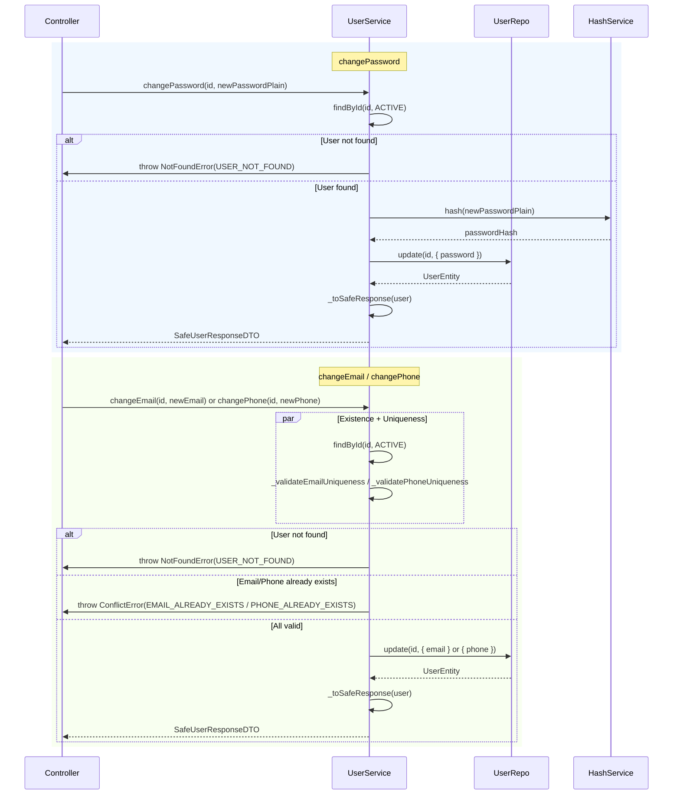
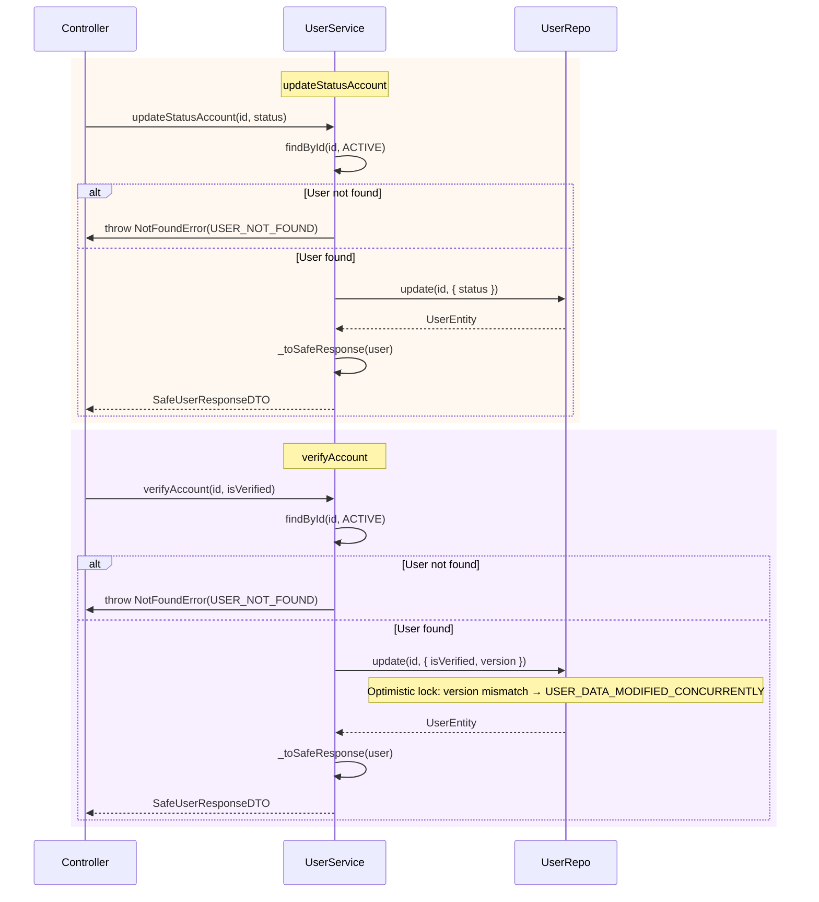
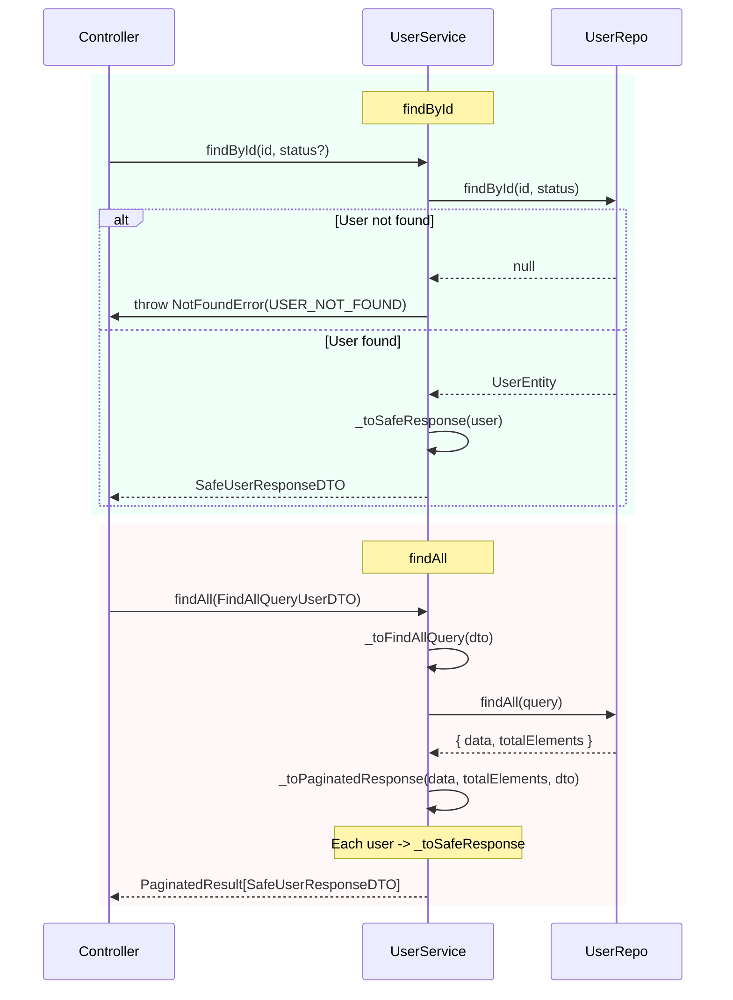

# Users Module

## 1. Responsibility

The **Users** module owns all user lifecycle operations and identity data. Its boundaries and goals are:

| Goal | Description |
|------|-------------|
| **User CRUD** | Create, read (findById, findByEmail, findByPhone, findAll with pagination), update profile, and manage account status |
| **Credential Verification** | Verify email/password pairs for authentication flows without exposing internal data |
| **Identity Uniqueness** | Enforce unique email and phone across the system |
| **Data Security** | Ensure passwords are never returned in API responses; all outputs go through Safe Response mapping |

---

## 2. Dependencies

### Internal Module Dependencies

| Module | Usage |
|--------|-------|
| **Shared** | Error enums (`ErrorUserCodes`), response types (`OK`, `Created`), validation middleware, pagination types |

### External / Infrastructure Dependencies

| Dependency | Purpose |
|------------|---------|
| **MongoDB (Mongoose)** | Persistence via `UserModel`; `MongooseUserRepo` implements `IUserRepository` |
| **Bcrypt** | Password hashing via `IHashService` (`BcryptHashAdapter`) — `hash()` and `compare()` |

---

## 3. Detailed Logic Flows

### 3.1 Create User

1. **Controller** receives validated `CreateUserDTO` (name, email, password, phone?, role?, addresses?).
2. **Service** runs uniqueness checks for email and phone in parallel.
3. **HashService** hashes the plain password before persistence.
4. **Service** maps DTO → entity (`status: ACTIVE`, `isVerified: false`, default `role: USER`).
5. **Repo** persists and returns the entity (including password).
6. **Service** maps entity → `SafeUserResponseDTO` via `_toSafeResponse` — password is stripped before returning.

---

### 3.2 Find By ID

- Returns `SafeUserResponseDTO` with `id`, `name`, `email`, `role`, `status`, `isVerified`, `addresses`, `version`, `createdAt`, `updatedAt`.
- Password and `__v` are never included.

---

### 3.3 Verify Credentials

Used by the Auth module for login.

- Repo uses `select('+password')` to load password; Service never returns it.
- Response is always `SafeUserResponseDTO` — no password in API output.

---

### 3.4 Password & Identity Updates (`changePassword`, `changeEmail`, `changePhone`)

These methods ensure the user exists and is active before performing updates. All return a `SafeUserResponseDTO` (no nulls for ID-based lookups — `findById` throws `USER_NOT_FOUND` if the user is missing or inactive).

**`changePassword`** first calls `findById(id, ACTIVE)` to validate existence; on success, hashes the new password and updates via the repository.

**`changeEmail`** and **`changePhone`** run the existence check and uniqueness validation in parallel via `Promise.all`:
- `findById(id, ACTIVE)` — throws `NotFoundError(USER_NOT_FOUND)` if user is missing or inactive
- `_validateEmailUniqueness(newEmail, id)` / `_validatePhoneUniqueness(newPhone, id)` — throws `ConflictError(EMAIL_ALREADY_EXISTS)` or `ConflictError(PHONE_ALREADY_EXISTS)` if the new value is already taken by another user (excluding the current user via `excludeId`)

---

### 3.5 Account Management (`updateStatusAccount`, `verifyAccount`)

**`updateStatusAccount`** ensures the user is `ACTIVE` before allowing a status change. It calls `findById(id, ACTIVE)` first; if the user is missing or not active, it throws `NotFoundError(USER_NOT_FOUND)`.

**`verifyAccount`** sets `isVerified` and explicitly passes the current `version` to the repository for optimistic locking. It fetches the active user via `findById(id, ACTIVE)` to obtain the version, then passes `{ isVerified, version: existingUser.version ?? 0 }` to the update. A version mismatch triggers `ConflictError(USER_DATA_MODIFIED_CONCURRENTLY)` (handled by the repository layer).

---

### 3.6 Data Querying (`findAll`, `findById`)

**`findById(id, status?)`** — Resolves a single user by ID, optionally filtered by status (e.g. `ACTIVE`). Throws `NotFoundError(USER_NOT_FOUND)` if no user matches. Never returns null for ID-based lookups; returns `SafeUserResponseDTO`.

**`findAll(dto)`** — Transforms `FindAllQueryUserDTO` into a repository query via `_toFindAllQuery`:

| DTO Field | Query Mapping |
|-----------|---------------|
| `page`, `limit` | `offset: (page - 1) * limit`, `limit` |
| `status` | `status` (optional filter) |
| `keyword` | `keyword` (optional search) |
| `role` | `role` (optional filter) |

The repository returns `{ data, totalElements }`. The service wraps this into `PaginatedResult<SafeUserResponseDTO>` via `_toPaginatedResponse`, which maps each item through `_toSafeResponse` and adds `pagination` (totalElements, totalPage, currentPage, elementsPerPage).

---

### 3.7 Internal Helper Logic (The "Safe" Gatekeeper)

Two private methods ensure all public-facing outputs conform to the Safe Response policy.

**`_toSafeResponse(user)`** — Converts a `UserEntity` (possibly a Mongoose document) into `SafeUserResponseDTO`:

1. **Mongoose document handling:** If the user has a `toObject` method (Mongoose documents do), call `(user as any).toObject()` to get a plain object; otherwise use the user as-is.
2. **Strip sensitive fields:** Use destructuring: `const { password, __v, ...safeData } = userObj` to exclude `password` and `__v` from the response.
3. **Return:** `safeData as SafeUserResponseDTO` — containing `id`, `name`, `email`, `phone`, `role`, `status`, `isVerified`, `addresses`, `version`, `createdAt`, `updatedAt`.

**`_toPaginatedResponse(data, total, dto)`** — Wraps a list of `UserEntity` into `PaginatedResult<SafeUserResponseDTO>`:

1. **Sanitize items:** `data.map((user) => this._toSafeResponse(user))`
2. **Build pagination metadata:** `totalElements`, `totalPage` (Math.ceil(total / limit)), `currentPage`, `elementsPerPage`
3. **Return:** `{ data: sanitizedData, pagination }`

| Input | Transformation | Output |
|-------|----------------|--------|
| `UserEntity` (from Repo) | Strip `password`, `__v`; keep safe fields | `SafeUserResponseDTO` |
| `UserEntity[]` + `total` + `dto` | Map each via `_toSafeResponse`, add pagination | `PaginatedResult<SafeUserResponseDTO>` |

**Where they are used:**

- `findById`, `findByEmail`, `findByPhone` → `_toSafeResponse`
- `create`, `changePassword`, `changeEmail`, `changePhone`, `updateStatusAccount`, `verifyAccount` → `_toSafeResponse`
- `findAll` → `_toPaginatedResponse` (which uses `_toSafeResponse` per item)
- `verifyCredentials` → `_toSafeResponse`

---

## 4. Technical Design

### 4.1 DTO Rules

| DTO | Layer | Purpose |
|-----|-------|---------|
| `CreateUserDTO` | Request | Incoming create payload: name, email, password, phone?, role?, addresses? |
| `UpdateUserDTO` | Request | Partial updates: name?, addresses? |
| `FindAllQueryUserDTO` | Request | Query: page?, limit?, status?, keyword?, role? |
| `SafeUserResponseDTO` | Response | Standard API response: id, name, email, phone, role, status, isVerified, addresses, version, timestamps |

- **Request DTOs** are validated by Zod schemas in `user.validator.ts` before reaching the Service.
- **Response** is always `SafeUserResponseDTO` — no internal/DB-only fields such as password.

### 4.2 Data Security

| Concern | Implementation |
|---------|----------------|
| **Password hashing** | `IHashService.hash()` (Bcrypt) before persistence; plain passwords never stored |
| **Password masking** | Centralized in `UserService._toSafeResponse()` — all returned users pass through it |
| **Password access in Repo** | Only for `findByEmail` / `findByPhone` when credentials must be verified; uses `select('+password')` |
| **API output** | All endpoints return `SafeUserResponseDTO` — password and `__v` are excluded |

---

## 5. Business Exceptions

Error codes from `ErrorUserCodes` enum. Values below are the API code strings sent to the client.

| Error Code (API Value) | HTTP Status | Description |
|------------------------|-------------|-------------|
| `USER_NOT_FOUND` | 404 | User with given ID does not exist or does not match status filter |
| `INVALID_CREDENTIALS` | 401 | Email/password combination is invalid (user not found or wrong password) |
| `EMAIL_ALREADY_EXISTS` | 409 | Email is already in use by another user |
| `PHONE_ALREADY_EXISTS` | 409 | Phone number is already in use by another user |
| `INVALID_USER_ID` | 400 | Invalid or empty user ID in request params |
| `USER_DATA_MODIFIED_CONCURRENTLY` | 409 | Optimistic lock conflict; version mismatch on update |
| `STREET_IS_REQUIRED` | 400 | Street is empty or invalid (`INVALID_STREET_FORMAT`) |
| `CITY_IS_REQUIRED` | 400 | City is empty or invalid (`INVALID_CITY_FORMAT`) |
| `NAME_MUST_BE_AT_LEAST_2_CHARS` | 400 | Name has fewer than 2 characters (`INVALID_NAME_FORMAT`) |
| `INVALID_EMAIL_FORMAT` | 400 | Email format is invalid |
| `PASSWORD_MUST_BE_AT_LEAST_6_CHARS` | 400 | Password has fewer than 6 characters (`INVALID_PASSWORD_FORMAT`) |
| `PHONE_NUMBER_MUST_BE_AT_LEAST_10_DIGITS` | 400 | Phone has fewer than 10 digits (`INVALID_PHONE_FORMAT`) |
| `USER_DATA_MAPPING_ERROR` | 500 | Internal mapping/domain conversion error |
| `USER_CREATE_FAILED` | 500 | User creation failed (used by Auth module; `CREATE_USER_FAILED`) |
| `USER_VERSION_IS_REQUIRED` | 500 | Version required for optimistic locking update but not provided |

---

## 6. Test Cases

### Happy Path

| # | Case | Input | Expected |
|---|------|-------|----------|
| 1 | Create user | Valid `CreateUserDTO` | 201, `SafeUserResponseDTO` without password |
| 2 | Find by ID | Valid ID | 200, `SafeUserResponseDTO` |
| 3 | Find by email | Valid email | 200, `SafeUserResponseDTO` or null |
| 4 | Find by phone | Valid phone | 200, `SafeUserResponseDTO` or null |
| 5 | Find all (paginated) | page, limit | 200, paginated list of `SafeUserResponseDTO` |
| 6 | Verify credentials | Valid email + password | `SafeUserResponseDTO` (no password) |
| 7 | Change password | Valid id + new password | Updated `SafeUserResponseDTO` |
| 8 | Change email | Valid id + new unique email | Updated `SafeUserResponseDTO` |
| 9 | Change phone | Valid id + new unique phone | Updated `SafeUserResponseDTO` |

### Edge Cases

| # | Case | Input | Expected |
|---|------|-------|----------|
| 1 | Duplicate email on create | Email already exists | 409, `EMAIL_ALREADY_EXISTS` |
| 2 | Duplicate phone on create | Phone already exists | 409, `PHONE_ALREADY_EXISTS` |
| 3 | Invalid credentials | Wrong password | 401, `INVALID_CREDENTIALS` |
| 4 | Invalid credentials | Non-existent email | 401, `INVALID_CREDENTIALS` |
| 5 | Find by ID not found | Invalid or non-existent ID | 404, `USER_NOT_FOUND` |
| 6 | Invalid user ID format | Empty or malformed ID param | 400, `INVALID_USER_ID` |
| 7 | Email format validation | Invalid email | 400, `INVALID_EMAIL_FORMAT` |
| 8 | Password length validation | Password &lt; 6 chars | 400, `INVALID_PASSWORD_FORMAT` |
| 9 | Name length validation | Name &lt; 2 chars | 400, `INVALID_NAME_FORMAT` |
| 10 | Optimistic lock conflict | Update with stale version | 409, `USER_DATA_MODIFIED_CONCURRENTLY` |
